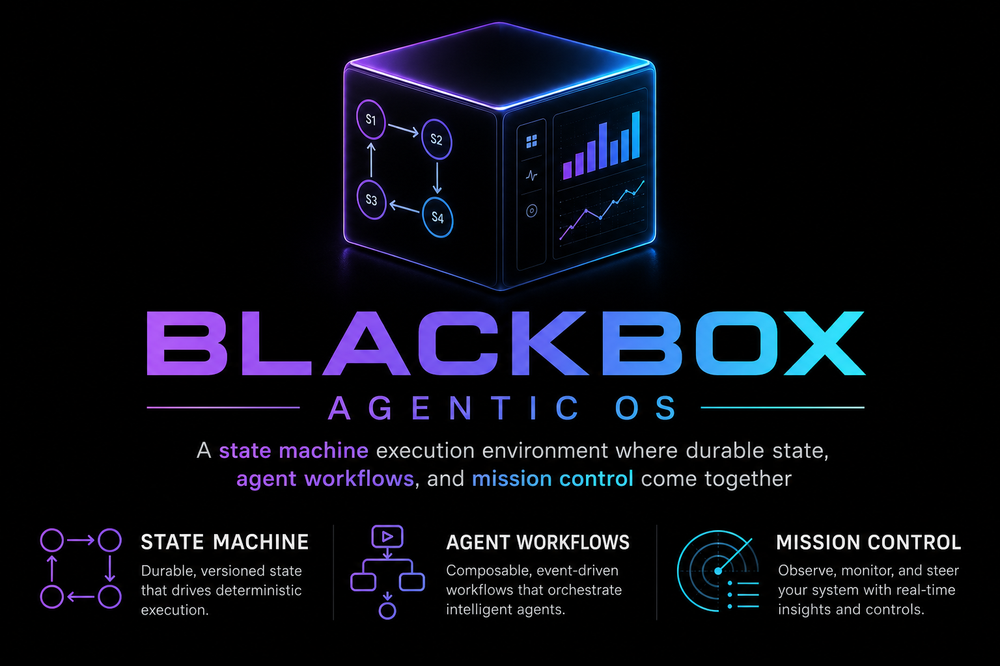

<p align="center">
  
</p>

# BLACKBOX — Obsidian-Cortex Agentic OS

A state machine execution environment where **durable state**, **agent workflows**, and **mission control** come together — Obsidian is the non-volatile state ledger, LangGraph orchestrates agent workflows, and the dashboard is mission control.

**For personal or small-business rollout** (non-technical): see [docs/implementation-guide.md](docs/implementation-guide.md).  
**Operator setup + Day 1:** [docs/blackbox-operator-guide.md](docs/blackbox-operator-guide.md).  
**SMB pain points & product fit:** [docs/smb-pain-research.md](docs/smb-pain-research.md).  
**Future concepts backlog** (Woo/Gmail, verticals, drivers): [docs/future-concepts.md](docs/future-concepts.md).  
**Vertical success research:** [docs/vertical-opportunities.md](docs/vertical-opportunities.md).  
**Tomorrow handoff (session state):** [docs/tomorrow-handoff.md](docs/tomorrow-handoff.md).  
**Fable build prompt (plugin / recovery / sandbox):** [docs/fable-continuation-prompt.md](docs/fable-continuation-prompt.md).  
**Fable session output (2026-07-04):** [docs/fable-session-notes.md](docs/fable-session-notes.md).  
**Product audit (2026-07):** [docs/product-audit-2026-07.md](docs/product-audit-2026-07.md).  
**Compliance Trust-Kit:** [docs/compliance/README.md](docs/compliance/README.md).  
**Gmail driver (draft-only):** [docs/gmail-driver.md](docs/gmail-driver.md).  
**Obsidian plugin:** [apps/obsidian-plugin/README.md](apps/obsidian-plugin/README.md).

## Quick Start (Local — Gemini, no Docker)

Recommended setup. Uses Google Gemini for LLM + embeddings and in-memory semantic RAG.

```powershell
# 1. Configure
copy .env.example apps\orchestrator\.env
# Edit apps\orchestrator\.env — set GEMINI_API_KEY

# 2. Orchestrator
cd apps\orchestrator
python -m venv .venv
.\.venv\Scripts\activate
pip install -e ".[dev]"
uvicorn api.main:app --reload --port 8000

# 3. Dashboard (new terminal)
cd apps\dashboard
npm install
npm run dev
```

Open http://localhost:3000

System Status should show **Gemini: up** and **RAG: semantic memory**.

After the first setup, `scripts\start-dev.bat` launches both processes in one step
(no Docker required). Orchestrator logs persist to `apps\orchestrator\data\logs\orchestrator.log`.

## Single-process mode (one port, no dev server)

For always-on local use, serve the whole app from one process. `scripts\serve.bat`
builds the dashboard into a static export and hosts both the UI and API from
uvicorn on `http://localhost:8000`:

```powershell
scripts\serve.bat
```

Under the hood it runs `npm run build` (with `NEXT_PUBLIC_SAME_ORIGIN=true` so the
UI calls the API on whatever origin served it — LAN and phone access just work)
and the orchestrator mounts `apps/dashboard/out/` at `/`. No second terminal, no
CORS or port juggling. Rebuild the export after changing dashboard code; the
two-terminal `start-dev.bat` flow remains best for hot-reload development.

## blackbox CLI

`scripts\blackbox.bat` (or `blackbox` inside the orchestrator venv) manages the
appliance:

| Command | What it does |
|---------|--------------|
| `blackbox start [--host 0.0.0.0]` | Start the orchestrator detached (no window), wait for health |
| `blackbox stop` | Stop it (kills the process tree; state recovers on next start) |
| `blackbox status` | Health, LLM/RAG mode, note count, Flash budget, pending approvals |
| `blackbox doctor [--fix]` | Preflight: vault, python, portable `drivers.json` ( `--fix` rewrites path tokens) |
| `blackbox recovery [--dismiss-all] [--resume PATH]` | List stale active-loop notes; resume orphans from checkpoint |
| `blackbox stats --days 7` | Per-skill usage and dogfood go/no-go metrics |
| `blackbox export --evidence --from DATE --to DATE` | Tamper-evident audit pack (JSON + SHA-256) → `vault/30-Archive/exports/` |
| `blackbox verify <evidence.json>` | Recompute integrity hash on an evidence export |
| `blackbox logs [-n 50] [-f]` | Tail the rotating orchestrator log |
| `blackbox backup [--out X]` | Zip vault (runtime dirs included) + all data stores to `backups/` — SQLite snapshotted consistently even while running |
| `blackbox restore <zip>` | Restore a backup (refuses while running; auto-backs-up current state first) |
| `blackbox install` | Register at-logon autostart via Task Scheduler (user session, so toasts work) |
| `blackbox uninstall` | Remove the scheduled task |

## Optional services (Docker)

Qdrant, PostgreSQL, and Ollama are optional accelerators — BLACKBOX runs without
them on in-memory RAG and SQLite. To start them, run `scripts\start-services.bat`
or use the full compose stack below.

Requires [Docker Desktop](https://www.docker.com/products/docker-desktop/).

```bash
cp .env.example .env
# Set GEMINI_API_KEY in .env for the orchestrator service

docker compose up -d --build
```

Open http://localhost:3000

Docker starts Qdrant, PostgreSQL, Ollama, orchestrator, and dashboard. Pass `GEMINI_API_KEY` via compose env or a `.env` file at repo root.

Optional Ollama models (if not using Gemini):

```bash
docker exec -it agentic-os-ollama-1 ollama pull llama3.2
docker exec -it agentic-os-ollama-1 ollama pull nomic-embed-text
```

## Skills

| Skill | Graph | Description |
|-------|-------|-------------|
| `gmail_inbox_brief` | pipeline | Morning inbox summary (cron trigger) |
| `customer_reply` | email_reply | Gmail thread → vault SOPs → draft → HITL → Gmail draft (no send) |
| `doc_summarize` | pipeline | PDF/DOCX via docs driver → structured archive summary |
| `summarize_note` | pipeline | Read any vault note, archive a summary |
| `summarize_meeting` | meeting | Meeting notes → decisions and action items |
| `inbox_triage` | pipeline | Classify a note — category, urgency, suggested action |
| `follow_up_draft` | pipeline | Follow-up email from vault context |
| `margin_compare` | pipeline | Deterministic margin math via margin MCP |
| `lead_gen` | Python | B2B outreach with human approval gate |
| `weekly_review` | Python | Weekly vault review and priorities |

Skill YAML lives in `vault/.system/skill-definitions/`. Shared context:
`GOALS.md`, `AGENTS.md`, FTS5 keyword search, RAG, and optional `sop_paths`
(full SOP text injected before retrieval — used by `customer_reply`).

## Daily Stack (dogfood ritual)

Operator rhythm in `vault/.system/GOALS.md`:

| Time | Loop |
|------|------|
| **08:00** | `gmail_inbox_brief` (cron) |
| **Day** | Drop PDF/DOCX in `00-Inbox/` → `doc_summarize` |
| **14:00** | `customer_reply` / follow-ups (manual) |
| **17:00** | Meeting summarize / day-close |

Success gate: **4 consecutive green dogfood weeks** before enabling send-after-approve.

## Adding a New Skill (no Python)

Drop a YAML file in `vault/.system/skill-definitions/` and click **Reload Skills**
(or `POST /api/v1/skills/reload`):

```yaml
name: my_skill
graph: pipeline                 # compiled into a checkpointed LangGraph
tools: [vault_fs.read_note]     # per-skill tool allowlist (closed by default)
nodes: [research, draft, critic, human_approval, finalize]
node_tools:                     # declarative tool calls; results usable in prompts
  research:
    - tool: vault_fs.read_note
      args: {path: "{user_input}"}
      output: note_text
node_prompts:
  draft: "Write a response based on:\n{note_text}"
max_cost_per_run: 0.10          # pre-step gate stops the run before overspend
```

`critic` + `human_approval` are optional reserved steps: including them adds a
confidence-scored approval interrupt. Complex branching graphs can still be
written in Python and registered in `core/graphs/registry.py`.

## Drivers (MCP tools)

Tool capability comes from MCP servers mounted at boot from
`vault/.system/drivers.json` (operator-owned; agents cannot write it).

Paths use portable tokens — `{PYTHON}`, `{ORCHESTRATOR_ROOT}`, `{VAULT_PATH}` —
expanded at mount time. Run `blackbox doctor --fix` after cloning on a new machine.

| Driver | Ships | Tools |
|--------|-------|-------|
| `vault_fs` | enabled | Read-only vault notes |
| `margin` | enabled | Deterministic margin math |
| `docs` | enabled | PDF/DOCX text extraction (`pypdf`, `python-docx`) |
| `gmail` | **disabled** | `list_threads`, `get_thread`, `create_draft`, `send_draft`* |
| `search` | disabled | Web search (Serper/Tavily) |
| `fs` / `shell` | disabled | npx examples |

\* `send_draft` is shadow-built for Phase 4-E but **disabled** until
`BLACKBOX_GMAIL_SEND_ENABLED=1` after the 4-green-week gate. Default flow is
draft-only; operator sends manually from Gmail.

- Driver subprocess env is **allowlist-only**; skills opt in via YAML `tools:`.
- Inspect with `GET /api/v1/drivers/`; remount with `POST /api/v1/drivers/remount`.

## Autonomy

Vault watch triggers in `vault/.system/trigger-rules/`:

- **`00-Inbox/*.md`** → `summarize_note` (meeting-tagged notes → `summarize_meeting`)
- **`00-Inbox/*.{pdf,docx}`** → `doc_summarize`
- **`gmail-morning-brief`** cron → `gmail_inbox_brief`

When only the interactive Flash reserve remains, autonomous runs park as
`budget_defer` interrupts and resume when the daily budget resets. Terminal
active-loop notes older than 7 days auto-archive to `30-Archive/active-loops/`
on boot.

## Architecture

- **vault/** — Obsidian vault with skill definitions, knowledge base, and archive
- **apps/orchestrator/** — FastAPI + LangGraph backend with RAG and WebSocket streaming
- **apps/dashboard/** — Next.js mission control with React Flow graph visualization

## API Endpoints

| Endpoint | Auth | Description |
|----------|------|-------------|
| `GET /api/v1/health` | Open | System status (vault, Qdrant, Gemini, Postgres) |
| `GET /api/v1/telemetry` | Open | Historical execution stats |
| `GET /api/v1/vault/tree` | Open | Vault folder/file listing |
| `GET /api/v1/vault/notes/{path}` | Open | Read a vault note (path-jailed) |
| `GET /api/v1/skills/` | Open | List skills + registered graphs |
| `GET /api/v1/runs/` | Open | Run history from the audit log (paged, newest first) |
| `GET /api/v1/runs/{thread_id}/events` | Open | Per-run node execution trace |
| `GET /api/v1/events/?since=N` | Open | Durable event outbox replay (dashboard reconnect) |
| `GET /api/v1/skills/interrupts` | Open | Pending interrupts (approval, budget, degraded, exec) |
| `GET /api/v1/drivers/` | Open | Mounted MCP drivers and their tool namespaces |
| `POST /api/v1/drivers/remount` | API key | Re-read drivers.json and remount |
| `POST /api/v1/skills/reload` | API key | Re-scan vault skill definitions |
| `POST /api/v1/skills/execute` | API key | Run a skill |
| `POST /api/v1/skills/approve` | API key | Approve/reject paused skill |
| `POST /api/v1/vault/reindex` | API key | Full vault reindex |
| `WS /ws/{session_id}` | Open | Real-time telemetry stream |

Set `BLACKBOX_API_KEY` in orchestrator `.env` and `NEXT_PUBLIC_BLACKBOX_API_KEY` in dashboard env to enable auth. Leave empty for open local dev.

## Environment

See `.env.example` for all configuration options. Key variables:

| Variable | Default | Description |
|----------|---------|-------------|
| `BLACKBOX_LLM_PROVIDER` | `gemini` | LLM backend: `gemini`, `ollama`, or `mock` |
| `BLACKBOX_ALLOW_MOCK` | `false` | Permit mock fallback when no real provider is available (archived as `mock-dry-run`) |
| `GEMINI_API_KEY` | — | Google AI Studio API key |
| `BLACKBOX_GEMINI_MODEL` | `gemini-2.5-flash-lite` | Generation model (see `.env.example` for 3.1 Flash Lite preset) |
| `BLACKBOX_GEMINI_EMBEDDING_MODEL` | `gemini-embedding-2` | RAG embedding model |
| `BLACKBOX_API_KEY` | empty | Optional API key for mutating endpoints |
| `BLACKBOX_USE_POSTGRES` | `false` | Use PostgreSQL for telemetry + checkpoints |
| `BLACKBOX_VAULT_PATH` | `./vault` | Obsidian vault location |
| `BLACKBOX_COST_ALERT_THRESHOLD` | `1.0` | Session cost alert in USD |
| `BLACKBOX_GEMINI_FLASH_DAILY_LIMIT` | `20` | Daily Flash request budget (free tier ~20 RPD) |
| `BLACKBOX_GEMINI_FLASH_INTERACTIVE_RESERVE` | `8` | Calls kept for manual runs; autonomous runs pause below this |
| `BLACKBOX_KERNEL_BACKGROUND_RUN_LIMIT` | `2` | Concurrent background runs; interactive runs are never queued |
| `BLACKBOX_GMAIL_SEND_ENABLED` | `false` | Phase 4-E: allow `gmail.send_draft` (after 4 green dogfood weeks) |
| `BLACKBOX_ACTIVE_LOOP_ARCHIVE_DAYS` | `7` | Auto-archive resolved loops from `20-Active-Loops/` |
| `BLACKBOX_ACTIVE_LOOP_AUTO_ARCHIVE` | `true` | Disable to skip boot-time loop cleanup |

## Production Features

- **Durable checkpoints** — LangGraph state persisted to SQLite (`data/checkpoints.db`) or Postgres
- **Pending approval recovery** — Paused threads survive orchestrator restarts
- **Persistent embedding cache** — Vectors cached in SQLite (`data/embeddings.db`); semantic
  memory rehydrates on restart with zero Gemini calls, and batch embedding
  (`batchEmbedContents`) indexes new content in one API call per ~100 chunks
- **No silent mock output** — Runs fail visibly when no LLM provider is configured;
  closeout notes record which provider produced them, and opted-in mock runs are
  archived as `mock-dry-run`, never as success
- **Append-only archive** — Closeout notes are timestamped per run with thread id;
  they are never overwritten
- **Gemini token/cost tracking** — Real usage metadata from API responses
- **Kernel token scheduler** — Every LLM/embed call is a priority-ordered kernel
  grant: interactive runs preempt queued background work at both the call and
  run level; pacing respects free-tier RPM limits
- **Interrupt Vector Table** — Budget- and degradation-deferred autonomous runs
  queue durably and resume unattended when the gate clears; approvals, budget
  defers, and exec denials all share one recovery surface
- **Event bus with durable outbox** — Every runtime event flows through an
  in-process bus into SQLite; reconnecting dashboards replay what they missed
  instead of gapping
- **Daily Flash budget** — Successful Gemini calls are counted per UTC day
  (`data/budget.db`); autonomous runs defer once only the interactive reserve
  remains, with a live meter in the dashboard and `/health`
- **Run history & node traces** — Every run and node event persists to JSONL,
  surfaced via `/api/v1/runs/` and the dashboard Run History card
- **Autonomous runs are visible** — A global event feed streams vault-trigger
  and cron activity into mission control as it happens
- **Incremental vault indexing** — File watcher re-indexes only changed notes;
  triggered skills receive the full content of the note that fired them
- **Path-jailed vault reads** — Prevents directory traversal outside vault root
- **Logs on disk** — Rotating orchestrator log at `data/logs/orchestrator.log`
- **Evidence export v1.1** — `blackbox export --evidence` bundles runs, approvals,
  tool calls, SOP version hashes, provider metadata, and drivers snapshot with
  SHA-256 integrity (`blackbox verify`)
- **Compliance Trust-Kit** — [docs/compliance/](docs/compliance/) maps existing IVT,
  outbox, and evidence export to deployer-side AI Act / ISO alignment (docs only,
  not legal advice)
- **Approval keyboard shortcuts** — Dashboard: `a` approve, `Shift+a` all, `r` reject

## Tests

```bash
cd apps/orchestrator
pip install -e ".[dev]"
pip install pypdf python-docx   # optional: docs driver / doc_summarize
pytest
```

~220 tests (1 skipped without optional doc deps).
