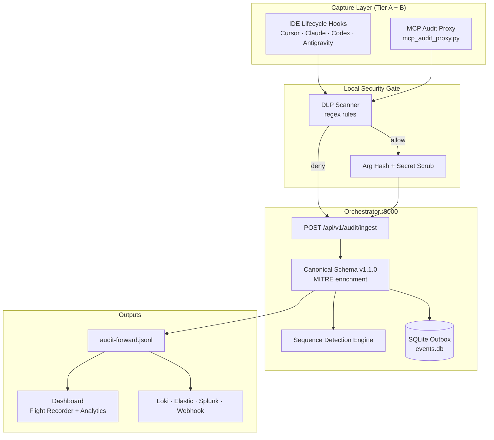
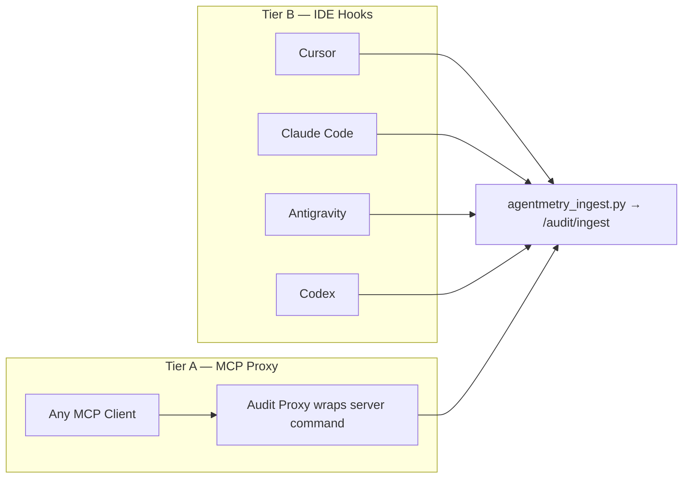
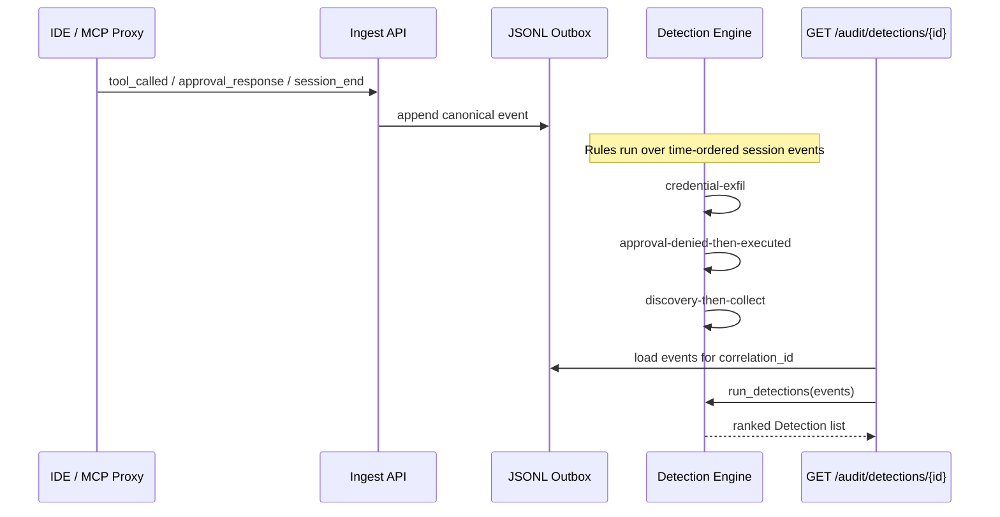
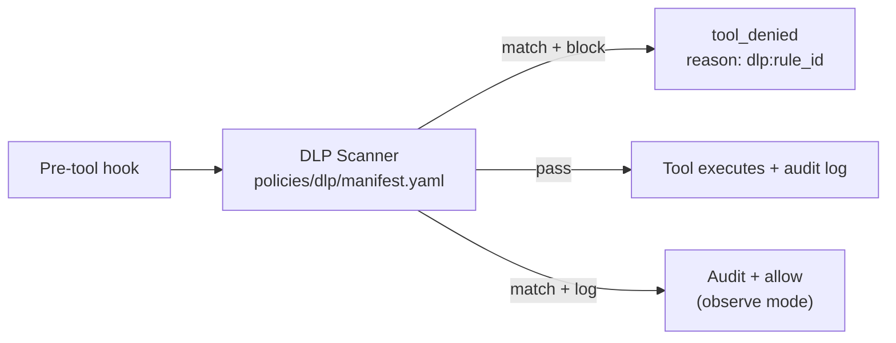

<div align="center">

<p align="center">
  <picture>
    <source media="(prefers-color-scheme: dark)" srcset="docs/logo/agentmetry-logo-white.svg">
    
  </picture>
</p>

<h1>Agentmetry: SIEM for AI Agents</h1>

<p>The open-source flight recorder and security layer for AI agent tool-use.<br/>
Every tool call, every denial, every human approval — hashed, correlated, and stored in a JSONL trail you own.<br/>
Replay on demand; forward to Loki, Elastic, or Splunk when you want a SIEM.</p>

<p align="center">
  <a href="https://github.com/blitzcrieg1/agentic-os/blob/master/LICENSE"></a>
  <a href="https://github.com/blitzcrieg1/agentic-os"></a>
  
</p>

<p align="center">
  <a href="#install--quick-start"><strong>Quickstart</strong></a> ·
  <a href="docs/agentmetry-external-ingest.md"><strong>Docs</strong></a> ·
  <a href="docs/agentmetry-event-schema.md"><strong>Schema</strong></a> ·
  <a href="docs/market_analysis.md"><strong>Roadmap</strong></a> ·
  <a href="#security"><strong>Security</strong></a>
</p>

</div>

---

> 🚧 **Public Alpha**: Core capture, replay, and SIEM forwarding are usable for early exploration. APIs and integration surfaces may evolve rapidly.

---

## Table of Contents

- [Why Agentmetry?](#why-agentmetry)
- [Install & Quick Start](#install--quick-start)
- [How Agentmetry Works](#how-agentmetry-works)
- [Coverage & Limitations](#coverage--limitations)
- [Capabilities & Integrations](#capabilities--integrations)
- [Behavioral Detection Engine](#behavioral-detection-engine)
- [Data Loss Prevention (DLP)](#data-loss-prevention-dlp)
- [Dashboard](#dashboard)
- [Forwarding to a SIEM](#forwarding-to-a-siem)
- [CLI Reference](#cli-reference)
- [Contributing](#contributing)
- [Security](#security)
- [License](#license)

---

## Why Agentmetry?

When an autonomous agent runs a tool, most stacks keep nothing you could hand to an incident responder. Logs show a process; they do not show **intent**, **session boundaries**, or **what the human approved**.

Agentmetry is the open-source **endpoint flight recorder** for AI agents — built to run entirely on your machine, with optional forwarding to the SIEM you already operate.

> an immutable, operator-owned audit trail for governed AI agents — capturing tool execution at the IDE lifecycle boundary and the MCP wire, not in a vendor cloud

We do that by:

- **Intercepting** agent tool calls through IDE lifecycle hooks (Cursor, Claude Code, Codex, Antigravity) and an MCP stdio audit proxy
- **Normalizing** every event into a canonical schema v1.1.0 with MITRE ATT&CK enrichment and SHA-256 argument hashing
- **Detecting** correlated behavioral sequences a single event cannot reveal (credential exfil, guardrail bypass, recon-then-grab)
- **Blocking** secrets and PII at the hook boundary with a local regex DLP engine (`log` or `block` mode)
- **Forwarding** the same JSONL trail to Loki, Elastic ECS, Splunk HEC, or a generic webhook — without making the cloud the system of record

**Agentmetry is not a CASB or shadow-AI spy.** It records the agents you wire in. If your problem is unmanaged ChatGPT in the browser, you need network/endpoint policy — not a flight recorder.

---

## Install & Quick Start

Agentmetry runs fully locally. The audit trail never leaves your machine unless you explicitly forward it.

### Prerequisites

| Requirement | Version |
|-------------|---------|
| Python | 3.10+ |
| Node.js | 18+ |

### 1. Clone and install

```powershell
git clone https://github.com/blitzcrieg1/agentic-os.git
cd agentic-os

# Python orchestrator
cd apps\orchestrator
python -m venv .venv
.\.venv\Scripts\activate
pip install -e ".[dev]"
copy .env.example .env
cd ..\..

# Next.js dashboard
cd apps\dashboard
npm install
cd ..\..
```

### 2. Boot the flight recorder

```powershell
scripts\start-dev.bat
```

Dashboard → [http://localhost:3000](http://localhost:3000) · Orchestrator API → [http://localhost:8000](http://localhost:8000)

### 3. Wire your IDEs (one-time)

```powershell
powershell -ExecutionPolicy Bypass -File scripts\install_cursor_hooks.ps1
powershell -ExecutionPolicy Bypass -File scripts\install_claude_hooks.ps1
```

Fully quit and restart Cursor / Claude Code so hooks load.

### 4. Verify

```powershell
python scripts\agentmetry_ingest.py selftest
```

Events should appear in the dashboard **Flight Recorder** within a few seconds.

When an agent runs a tool, Agentmetry automatically:

1. **Intercepts** the lifecycle hook or MCP `tools/call` before arguments leave the hook process
2. **Hashes** tool arguments (SHA-256) and scrubs inline secrets in command strings
3. **Enriches** each event with MITRE tactic/technique mappings and session correlation
4. **Stores** canonical JSONL locally (`audit-forward.jsonl`) — the system of record for the hook path
5. **Detects** multi-step behavioral patterns across the session timeline
6. **Forwards** to your SIEM sinks and alert webhook (optional, best-effort)

---

## How Agentmetry Works

### Architecture



### Capture paths



| Component | Path | Role |
|-----------|------|------|
| **Hook client** | `scripts/agentmetry_ingest.py` | Maps IDE lifecycle events to canonical payloads; hashes args in-process |
| **MCP proxy** | `apps/orchestrator/tools/mcp_audit_proxy.py` | Wraps any stdio MCP server; logs every `tools/call` + errors |
| **Ingest API** | `core/audit/ingest.py` | Normalizes payloads, infers approvals (`inferred:*`), writes sinks |
| **DLP engine** | `core/audit/dlp/` | Regex scan of tool arguments (validators, e.g. Luhn); block or log before execution |
| **Detection engine** | `core/audit/detection/` | Correlated sequence rules over a session's event timeline |
| **Sinks** | `core/audit/sinks.py` | File, webhook, Elastic ECS, Splunk HEC |
| **Replay** | `core/audit/replay.py` | ASCII timeline reconstruction from the local outbox |

### The canonical event

Every run emits typed, SIEM-ready JSON. A single `tool_called` line:

```json
{
  "schema_version": "1.1.0",
  "correlation_id": "thread-8892",
  "timestamp_utc": "2026-07-12T09:14:22.041+00:00",
  "actor": {"type": "user", "id": "dev_01", "role": "operator"},
  "action": {"type": "tool_called", "outcome": "success"},
  "agent": {"name": "cursor", "skill_id": ""},
  "tool": {
    "qualified": "vault_fs.read_file",
    "server": "vault_fs",
    "input_hash": "e3b0c44298fc1c149afbf4c8996fb92427ae41e4649b934ca495991b7852b855",
    "parameters_redacted": true,
    "mitre": {"tactic": "Collection (TA0009)", "technique": "Data from Local System (T1005)"}
  },
  "model": {"id": "claude-3-5-sonnet", "provider": "anthropic"}
}
```

Full schema → [docs/agentmetry-event-schema.md](docs/agentmetry-event-schema.md)

---

## Coverage & Limitations

Agentmetry records agents you wire in — **IDE hooks** or the **MCP proxy**. It is honest about what it cannot see.

| Tier | Setup | Agentmetry coverage |
|------|-------|---------------------|
| **A** | MCP servers wrapped with the audit proxy | **Full tool-call capture** — every `tools/call` + error responses, arg hashes, session correlation |
| **B** | IDE hooks (Cursor, Claude, Codex, Antigravity) | Tool calls (success/failure), approval prompts; approve/deny **inferred** from execution and flagged `inferred:*` |
| **C** | Unmanaged ChatGPT, Cursor with hooks off | **Not visible.** CASB / secure-web-gateway territory |

---

## Capabilities & Integrations

| | |
| --- | --- |
| 🎥 **Flight Recorder** | Live audit tail with dynamic columns, drag-and-drop layout, CSV export, and session drill-down |
| 📊 **Analytics & Process Tree** | Session-level charts, MITRE tactic breakdown, horizontal React Flow timeline |
| 🔍 **Behavioral Detection** | Correlated sequence rules — credential exfil, guardrail bypass, recon-then-grab |
| 🛡️ **Local DLP** | Regex scanner blocks AWS keys, GitHub tokens, Slack tokens, and PII before tool execution |
| 🎯 **MITRE ATT&CK mapping** | Per-tool tactic/technique tags on every canonical event |
| 🔐 **Argument hashing** | SHA-256 of tool args by default — plaintext never crosses the wire from hooks |
| 📡 **SIEM-native export** | Elastic ECS, Splunk HEC, Loki/LogQL, generic webhook, alert webhook on denials |
| 🔁 **Replay & evidence** | ASCII session timeline + tamper-evident evidence pack export |
| 👥 **Multi-IDE support** | Cursor, Claude Code, Codex, Antigravity — global hook install scripts |

### Integrations

| Category | Supported today | Roadmap |
| -------- | --------------- | ------- |
| **IDE / Agent hosts** | Cursor · Claude Code · Codex · Antigravity | Windsurf · VS Code Copilot |
| **MCP transport** | Stdio audit proxy (wrap any MCP server command) | SSE / streamable HTTP proxy |
| **Observability / SIEM** | Loki · Grafana · Elastic ECS · Splunk HEC · generic webhook | Datadog · New Relic |
| **Detection formats** | In-engine sequence rules · LogQL · Elastic · Splunk · [Sigma pack](docs/integrations/sigma/README.md) | STIX/TAXII export |
| **Policy engines** | Regex DLP manifest (`policies/dlp/`) | OPA / Rego policy-as-code |
| **Compliance docs** | [ISO 42001 mapping](docs/compliance/iso-42001-mapping.md) · [AI Act checklist](docs/compliance/ai-act-deployer-checklist.md) | SOC 2 evidence templates |

Agentmetry is community-built. Browse [open issues](https://github.com/blitzcrieg1/agentic-os/issues) or see [docs/market_analysis.md](docs/market_analysis.md) for the contributor roadmap.

---

## Behavioral Detection Engine

Per-event MITRE tags say *what* a single tool call is. The detection engine says what a **sequence** of calls means — the signal an EDR cannot see because it never had the agent's session boundary.

Rules run **as events arrive**. A firing rule is emitted once per session as a first-class canonical event (`action.type: detection`, `action.outcome: <severity>`) down the same sinks as everything else — so it reaches your SIEM, your alert webhook, and the live feed without anyone opening a dashboard. The same findings are recomputed from the trail on `GET /audit/detections/{correlation_id}`.

> **Alpha limitation.** Live correlation state is in-memory and per-process: restarting the orchestrator resets alerting continuity for in-flight sessions. The JSONL trail stays authoritative, so no detection is ever *lost* — it is recomputed on query — but a restart mid-session can delay a live alert. Detection state is not shared across processes.



| Rule ID | Severity | Pattern |
| ------- | -------- | ------- |
| `credential-exfil` | critical | Credential access (T1552) → network egress (TA0011) |
| `approval-denied-then-executed` | critical | Human denied a gated tool → same tool executed successfully later |
| `autonomous-unapproved-write` | high | Autonomous agent writes/deletes with no prior human approval |
| `discovery-then-collect` | medium | Filesystem recon burst (TA0007) → data collection |

Query detections for a session:

```http
GET /api/v1/audit/detections/{correlation_id}
X-API-Key: <optional>
```

---

## Data Loss Prevention (DLP)

Agentmetry ships a local regex DLP engine that scans tool arguments **before** they are executed or logged. When a match fires in `block` mode, the hook denies execution and emits a `tool_denied` event.



| Env | Default | Description |
| --- | ------- | ----------- |
| `AGENTMETRY_DLP_MODE` | `log` | `log` · `block` · `disable` |
| `AGENTMETRY_DLP_PII` | `1` | Enable PII rules (SSN, etc.) |
| `AGENTMETRY_DLP_RULES_PATH` | `policies/dlp/manifest.yaml` | Custom rule manifest |

Rules cover AWS keys, GitHub PATs, Slack tokens, bearer headers, and US SSN patterns. Add custom regex rules without touching Python — drop entries into the manifest.

---

## Dashboard

The Next.js dashboard at `:3000` gives SOC analysts a live view of agent activity:

| View | Features |
| ---- | -------- |
| **Flight Recorder** | Real-time event tail, source badges, outcome filters, expandable row detail, raw JSON view |
| **Column manager** | Drag-and-drop column layout featuring built-in fields for model, skill, host, MCP server, and failure reasons — reorder or hide via the Columns settings panel |
| **Analytics** | Outcome distribution, MITRE tactic chart, session ID search |
| **Process Tree** | Horizontal React Flow timeline of events within a selected session |

Dark mode supported with theme toggle. Logo and panels adapt automatically.

---

## Forwarding to a SIEM

For agents captured via IDE hooks (the common case), the canonical JSONL trail is the **system of record**; the SQLite outbox backs the orchestrator's own runs. Forwarders are best-effort.

| Sink | Env |
|------|-----|
| **File (default)** | `AGENTMETRY_AUDIT_SINK=file` |
| **Webhook** | `AGENTMETRY_AUDIT_SINK=webhook` + `AGENTMETRY_AUDIT_WEBHOOK_URL=...` |
| **Elastic ECS** | `AGENTMETRY_AUDIT_SINK=elastic` + `AGENTMETRY_AUDIT_ELASTIC_URL` + `AGENTMETRY_ELASTIC_API_KEY` |
| **Splunk HEC** | `AGENTMETRY_AUDIT_SINK=splunk` + `AGENTMETRY_AUDIT_SPLUNK_HEC_URL` + `AGENTMETRY_SPLUNK_HEC_TOKEN` |
| **Alert webhook** | `AGENTMETRY_AUDIT_ALERT_WEBHOOK_URL=...` (fires on denied/error outcomes) |

Legacy `AGENTMETRY_*` variables are still accepted as aliases during the transition.

Homelab SIEM with Loki + Grafana:

```powershell
docker compose -f docker-compose.loki.yml up -d
# Grafana → http://localhost:3001
# Explore: {job="agentmetry"} | json
```

Integration guides → [docs/integrations/](docs/integrations/)

---

## CLI Reference

`scripts\agentmetry.bat` (or `python -m cli` inside the orchestrator venv):

| Command | What it does |
|---------|--------------|
| `agentmetry start` / `stop` / `status` | Run the orchestrator detached; check health |
| `agentmetry replay <thread_id>` | ASCII audit timeline for one run, from `events.db` |
| `agentmetry export --evidence` | Tamper-evident batch pack (JSON + SHA-256) |
| `agentmetry verify <evidence.json>` | Recompute the integrity hash on an evidence export |
| `agentmetry doctor` | Preflight check for python, paths, etc. |

`scripts\agentmetry.bat` remains as a legacy alias.

---

## Contributing

Agentmetry welcomes contributions across detection rules, DLP patterns, SIEM adapters, and dashboard UX.

| Area | Start here |
| ---- | ---------- |
| Hook adapters | [docs/agentmetry-external-ingest.md](docs/agentmetry-external-ingest.md) |
| Event schema | [docs/agentmetry-event-schema.md](docs/agentmetry-event-schema.md) |
| Detection rules | `apps/orchestrator/core/audit/detection/rules.py` |
| DLP rules | `policies/dlp/manifest.yaml` |
| Sigma pack | [docs/integrations/sigma/README.md](docs/integrations/sigma/README.md) |
| Roadmap | [docs/market_analysis.md](docs/market_analysis.md) |

Run tests before opening a PR:

```powershell
cd apps\orchestrator
python -m ruff check core api tests
python -m pytest -q
```

---

## Security

Agentmetry is designed for security-sensitive environments:

- **Local-first** — audit data stays on your machine unless you configure forwarders
- **Argument hashing by default** — plaintext tool args never leave the hook process
- **Optional API key** — protect ingest/tail/export endpoints with `AGENTMETRY_API_KEY`
- **DLP blocking** — stop secrets and PII from reaching tool execution boundaries
- **Tamper-evident exports** — evidence packs include SHA-256 integrity hashes

Report vulnerabilities via GitHub Issues with the `security` label, or open a private security advisory on the repository.

Compliance docs → [docs/compliance/](docs/compliance/)

---

## License

Apache-2.0. Contributions, schema feedback, and detection rules welcome!
