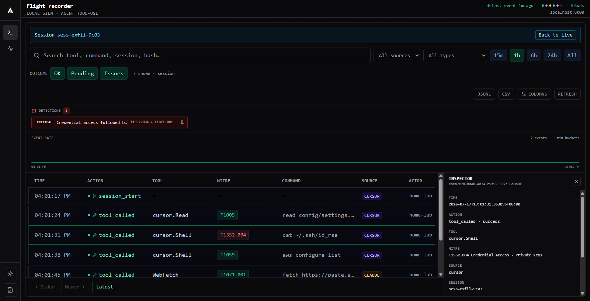
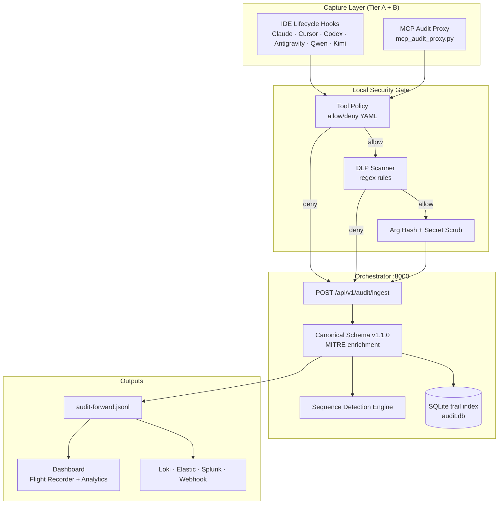
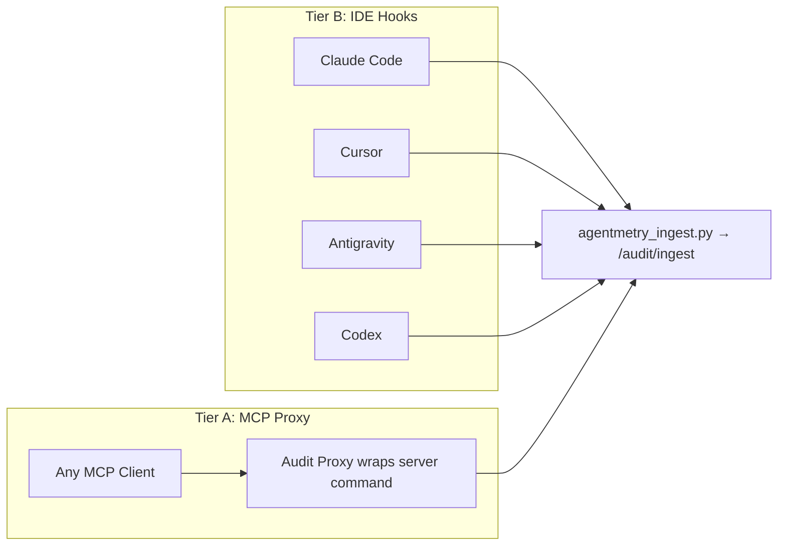
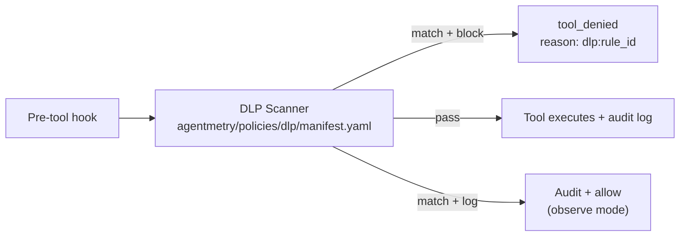

<div align="center">

<p align="center">
  <picture>
    <source media="(prefers-color-scheme: dark)" srcset="docs/logo/agentmetry-logo-white.svg">
    
  </picture>
</p>

<h1>Agentmetry: the local flight recorder for AI coding agents</h1>

<p><strong>Your agent reads a private key, then makes a network call. Your EDR sees a process.<br/>
Agentmetry sees the sequence, tags it with MITRE ATT&CK, and fires one CRITICAL alert.</strong></p>

<p>Records every tool call, denial, and approval from Claude Code, Cursor, Codex and Antigravity into a JSONL trail you own.<br/>
Runs on your machine. Forward to Loki, Elastic, or Splunk only if you want to.</p>

<p align="center">
  <a href="https://github.com/blitzcrieg1/agentmetry/blob/master/LICENSE"></a>
  <a href="https://github.com/blitzcrieg1/agentmetry"></a>
  
</p>

<p align="center">
  <a href="#install--quick-start"><strong>Quickstart</strong></a> ·
  <a href="docs/agentmetry-external-ingest.md"><strong>Docs</strong></a> ·
  <a href="docs/agentmetry-event-schema.md"><strong>Schema</strong></a> ·
  <a href="ROADMAP.md"><strong>Roadmap</strong></a> ·
  <a href="#security"><strong>Security</strong></a>
</p>

</div>

<div align="center">

<!--
  DEMO VIDEO. Keep the line below a bare github.com/user-attachments URL on its
  own line. That is the only form GitHub renders as an inline player: release,
  raw and blob URLs serve the MP4 as application/octet-stream and download
  instead of playing, and <video src="docs/assets/..."> is stripped by the HTML
  sanitizer. To replace the video, see docs/readme-media.md
-->

https://github.com/user-attachments/assets/edd2002e-47c1-4885-8500-b3651f648018

<p><em>Event stream, detections strip, and live feed: every tool call tagged with MITRE ATT&amp;CK, with <strong>correlated CRITICAL alerts</strong> when a sequence adds up to an attack.</em><br/>
Run it yourself with <code>python scripts/demo_dashboard.py</code></p>

</div>

---

> 🚧 **Public Alpha**: Core capture, replay, and SIEM forwarding are usable for early exploration. APIs and integration surfaces may evolve rapidly.

---

## Table of Contents

- [Why Agentmetry?](#why-agentmetry)
- [Install & Quick Start](#install--quick-start)
- [How Agentmetry Works](#how-agentmetry-works)
- [Coverage & Limitations](#coverage--limitations)
- [Capabilities & Integrations](#capabilities--integrations)
- [Behavioral Detection Engine](#behavioral-detection-engine)
- [Data Loss Prevention (DLP)](#data-loss-prevention-dlp)
- [Dashboard](#dashboard)
- [Forwarding to a SIEM](#forwarding-to-a-siem)
- [CLI Reference](#cli-reference)
- [Contributing](#contributing)
- [Security](#security)
- [License](#license)

---

## Why Agentmetry?

When an autonomous agent runs a tool, most stacks keep nothing you could hand to an incident responder. Logs show a process; they do not show **intent**, **session boundaries**, or **what the human approved**.

Agentmetry is the open-source **endpoint flight recorder** for AI agents. It runs entirely on your machine, with optional forwarding to the SIEM you already operate.

**Observability-first by design.** Every tool call, denial, and approval lands in a JSONL trail you own, with correlated sequence alerts when individually-innocent calls add up to an attack. That is the layer EDR never had: the agent's session, not just the host process. Prevention is opt-in; the default is detect and record. What that does *not* cover is set out in [Coverage & Limitations](#coverage--limitations).

We do that by:

- **Intercepting** agent tool calls through IDE lifecycle hooks (Claude Code, Cursor, Codex, Antigravity) and an MCP stdio audit proxy
- **Normalizing** every event into a canonical schema v1.1.0 with MITRE ATT&CK enrichment and SHA-256 argument hashing
- **Detecting** correlated behavioral sequences a single event cannot reveal (credential exfil, guardrail bypass, download cradles, agent data injection, recon-then-grab)
- **Scanning** secrets and PII at the hook boundary with a local regex DLP engine (`log` by default; opt-in `block` mode)
- **Forwarding** the same JSONL trail to Elastic ECS, Splunk HEC, or a generic webhook (Loki via Alloy tailing the local file), without making the cloud the system of record

**Agentmetry is not a shadow-AI spy.** If your problem is unmanaged ChatGPT in the browser, you need network or endpoint policy, not a flight recorder.

---

## Install & Quick Start

Agentmetry runs fully locally. The audit trail never leaves your machine unless you explicitly forward it.

### Install (30 seconds)

```bash
pip install agentmetry
agentmetry doctor
```

No server, no API key, no config. The DLP rules, tool policy and detection
manifests ship inside the package, so `doctor` should come back clean.

### Check the detection claims before you trust them

The corpus ships in the package too, so this works from a fresh install with no
clone:

```bash
agentmetry benchmark
```

It replays recorded sessions through the real rule engine and exits non-zero on
any missed rule or any false positive. The benign half is the number that
matters, and what it covers and does not cover is set out in
[Behavioral Detection Engine](#behavioral-detection-engine).

### See it catch something (needs the repo)

The demo scripts and the dashboard are not part of the package, so this half
needs a clone:

```bash
git clone https://github.com/blitzcrieg1/agentmetry.git && cd agentmetry
pip install -e apps/orchestrator
python scripts/demo.py
python scripts/demo.py --scenario hf   # HF July 2026 agentic intrusion patterns
```

No single one of those events is an alert. The sequence is. That is the whole
product in one screen.

### The artifact: JSONL trail vs dashboard

Before you install hooks, here is what you get. The demo above writes a few lines
to a local JSONL file (`data/audit-forward.jsonl`). Each line is one canonical
event. None of the tool calls alone is an alert; the detection engine emits a
**fourth line** when the sequence completes:

```jsonl
{"correlation_id":"demo-sess","action":{"type":"tool_called","outcome":"success"},"tool":{"qualified":"cursor.Read","command":"cat ~/.ssh/id_rsa","input_hash":"…","mitre":{"tactic_id":"TA0006","technique_id":"T1552.004"}}}
{"correlation_id":"demo-sess","action":{"type":"tool_called","outcome":"success"},"tool":{"qualified":"cursor.Shell","input_hash":"…"},"dlp":{"rule_id":"aws_access_key","mode":"log","severity":"critical"}}
{"correlation_id":"demo-sess","action":{"type":"tool_called","outcome":"success"},"tool":{"qualified":"WebFetch","command":"fetch https://paste.example.com/upload","mitre":{"tactic_id":"TA0011","technique_id":"T1071.001"}}}
{"correlation_id":"demo-sess","action":{"type":"detection","outcome":"critical"},"detection":{"rule_id":"credential-exfil","severity":"critical","summary":"cursor.Read accessed credentials, then WebFetch egressed to the network in the same session.","event_ids":["…","…"]}}
```

The same session in the dashboard: the detections strip surfaces the CRITICAL
finding; the event feed links each row back to the trail lines above:

<p align="center">
  
</p>

Tool arguments are hashed by default (`input_hash`); DLP records the **rule id**,
never the secret value. The detection line is also written to your SIEM sinks if
you configure them, so you do not need the dashboard open to get paged.

### See the dashboard with a story in it

The dashboard is a static export, and it is not checked into the repo, so build
it once first:

```bash
cd apps/dashboard && npm install && npm run build && cd ../..
```

```bash
python scripts/demo_dashboard.py            # seeds 7 sessions + 5 detections, serves http://127.0.0.1:8010/
python scripts/demo_dashboard.py --live     # ...and streams synthetic agent traffic in real time
```

That seeds a realistic demo trail and serves the dashboard locally, with no API
key and no cloud. Seven sessions, five real detections (computed by the pipeline,
not hand-written). The feed shows approval gates, tool calls, and inline detection
events across Event stream, Detections, and Analytics tabs. Without the build step
the script still seeds the trail and serves the API, and it will tell you the
dashboard export is missing.

See the [dashboard tour](docs/dashboard-tour.md) for what each view shows and how
to read it.

### Prerequisites

| Requirement | Version |
|-------------|---------|
| Python | 3.11+ |
| Node.js | 18+ (dashboard only) |

### Windows one-flow install

From a fresh clone on Windows 11:

```powershell
git clone https://github.com/blitzcrieg1/agentmetry.git
cd agentmetry
powershell -ExecutionPolicy Bypass -File scripts\install.ps1
scripts\start-dev.bat
```

`install.ps1` creates the orchestrator venv, installs Python + dashboard deps, copies `.env.example`, wires Claude Code and Cursor hooks, and runs `agentmetry doctor --fix` (creates portable `drivers.json` from the example). Skip hooks with `-SkipHooks`; orchestrator-only with `-SkipDashboard`. Opt-in hook enforcement with `-ToolPolicyBlock` or `-DlpBlock`.

### Manual install

```powershell
git clone https://github.com/blitzcrieg1/agentmetry.git
cd agentmetry

# Python orchestrator
cd apps\orchestrator
python -m venv .venv
.\.venv\Scripts\activate
pip install -e ".[dev]"
copy .env.example .env
cd ..\..

# Next.js dashboard
cd apps\dashboard
npm install
cd ..\..
```

### 2. Boot the flight recorder

```powershell
scripts\start-dev.bat
```

Dashboard → [http://localhost:3000](http://localhost:3000) · Orchestrator API → [http://localhost:8000](http://localhost:8000)

### 3. Wire your IDEs (one-time)

```powershell
powershell -ExecutionPolicy Bypass -File scripts\install_claude_hooks.ps1
powershell -ExecutionPolicy Bypass -File scripts\install_cursor_hooks.ps1
```

Fully quit and restart Claude Code / Cursor so hooks load.

### 4. Verify

```powershell
python scripts\agentmetry_ingest.py selftest
```

Events should appear in the dashboard **Flight Recorder** within a few seconds.

When an agent runs a tool, Agentmetry automatically:

1. **Intercepts** the lifecycle hook or MCP `tools/call` before arguments leave the hook process
2. **Hashes** tool arguments (SHA-256) and scrubs inline secrets in command strings
3. **Enriches** each event with MITRE tactic/technique mappings and session correlation
4. **Stores** canonical JSONL locally (`audit-forward.jsonl`), the system of record for the hook path; each new line is hash-chained for tamper detection
5. **Detects** multi-step behavioral patterns across the session timeline
6. **Forwards** to your SIEM sinks and alert webhook (optional, best-effort)

Verify the local trail after capture:

```powershell
agentmetry verify --trail apps\orchestrator\data\audit-forward.jsonl
```

**What the chain does and does not prove.** Verification catches in-place edits, inserted or reordered lines, and forged appends, and it cross-checks the `.chain` sidecar to catch a truncated file. It cannot, by itself, prove the newest lines were not deleted along with the sidecar: any actor with full write access to the trail can also rewrite the sidecar. For that, `verify` prints the current chain head (sequence number plus SHA-256). Record it somewhere the audited agent cannot write (a git commit, a note, a password manager entry) and compare on the next verify.

Two scope limits worth stating plainly:

- **Only lines written after chaining was enabled are covered.** A trail that predates it keeps its earlier lines as a legacy unchained prefix, and `verify` reports them separately rather than vouching for them. On a long-running install most of the file can be legacy, so read the chained/legacy counts in the verify output, not just the `OK`.
- **The chain protects the JSONL, not the dashboard.** The dashboard reads a SQLite index derived from the same canonical events. The two agree in practice, but the index carries no chain: the JSONL is the artifact you hand to an incident responder.

---

## How Agentmetry Works

### Architecture


```mermaid
flowchart TB
  subgraph Capture["Capture Layer (Tier A + B)"]
    HOOKS["IDE Lifecycle Hooks<br/>Claude · Cursor · Codex · Antigravity · Qwen · Kimi"]
    PROXY["MCP Audit Proxy<br/>mcp_audit_proxy.py"]
  end

  subgraph Gate["Local Security Gate"]
    POLICY["Tool Policy<br/>allow/deny YAML"]
    DLP["DLP Scanner<br/>regex rules"]
    HASH["Arg Hash + Secret Scrub"]
  end

  subgraph Core["Orchestrator :8000"]
    INGEST["POST /api/v1/audit/ingest"]
    CANON["Canonical Schema v1.1.0<br/>MITRE enrichment"]
    DETECT["Sequence Detection Engine"]
    TRAILDB[("SQLite trail index<br/>audit.db")]
  end

  subgraph Output["Outputs"]
    JSONL["audit-forward.jsonl"]
    DASH["Dashboard<br/>Flight Recorder + Analytics"]
    SIEM["Loki · Elastic · Splunk · Webhook"]
  end

  HOOKS --> POLICY
  PROXY --> POLICY
  POLICY -->|allow| DLP
  POLICY -->|deny| INGEST
  DLP -->|allow| HASH
  DLP -->|deny| INGEST
  HASH --> INGEST
  INGEST --> CANON
  CANON --> TRAILDB
  CANON --> JSONL
  CANON --> DETECT
  JSONL --> DASH
  JSONL --> SIEM
```

### Capture paths


```mermaid
flowchart LR
  subgraph TierB["Tier B: IDE Hooks"]
    CL["Claude Code"]
    C["Cursor"]
    AG["Antigravity"]
    CX["Codex"]
  end

  subgraph TierA["Tier A: MCP Proxy"]
    MCP["Any MCP Client"]
    WRAP["Audit Proxy wraps server command"]
  end

  INGEST["agentmetry_ingest.py → /audit/ingest"]

  CL --> INGEST
  C --> INGEST
  AG --> INGEST
  CX --> INGEST
  MCP --> WRAP --> INGEST
```

| Component | Path | Role |
|-----------|------|------|
| **Hook client** | `scripts/agentmetry_ingest.py` | Maps IDE lifecycle events to canonical payloads; hashes args in-process |
| **MCP proxy** | `apps/orchestrator/tools/mcp_audit_proxy.py` | Wraps any stdio MCP server; logs every `tools/call` + errors |
| **Ingest API** | `core/audit/ingest.py` | Normalizes payloads, infers approvals (`inferred:*`), writes sinks |
| **Tool policy** | `core/audit/tool_policy/` | Allow/deny by tool name (glob) and optional shell regex; runs before DLP |
| **DLP engine** | `core/audit/dlp/` | Regex scan of tool arguments (validators, e.g. Luhn); `log` or `block` before execution |
| **Detection engine** | `core/audit/detection/` | Correlated sequence rules over a session's event timeline |
| **Sinks** | `core/audit/sinks.py` | File, webhook, Elastic ECS, Splunk HEC |
| **Replay** | `core/audit/replay.py` | ASCII timeline from the governed-runtime outbox (`events.db`); hook users use the dashboard or JSONL |

### The canonical event

Every run emits typed, SIEM-ready JSON. A single `tool_called` line:

```json
{
  "schema_version": "1.1.0",
  "correlation_id": "thread-8892",
  "timestamp_utc": "2026-07-12T09:14:22.041+00:00",
  "host_id": "dev-laptop",
  "fleet_id": "consulting-pilot",
  "actor": {"type": "user", "id": "dev_01", "role": "operator"},
  "action": {"type": "tool_called", "outcome": "success"},
  "agent": {"name": "cursor", "skill_id": ""},
  "tool": {
    "qualified": "vault_fs.read_file",
    "server": "vault_fs",
    "input_hash": "e3b0c44298fc1c149afbf4c8996fb92427ae41e4649b934ca495991b7852b855",
    "parameters_redacted": true,
    "mitre": {
      "tactic_id": "TA0009",
      "tactic": "Collection",
      "technique_id": "T1005",
      "technique": "Data from Local System"
    }
  },
  "model": {"id": "claude-3-5-sonnet", "provider": "anthropic"}
}
```

Full schema → [docs/agentmetry-event-schema.md](docs/agentmetry-event-schema.md)

---

## Coverage & Limitations

Everything Agentmetry cannot do is here, in one place, so you can decide in two
minutes instead of finding out in month two.

### What it sees

| Tier | Setup | Agentmetry coverage |
|------|-------|---------------------|
| **A** | MCP servers wrapped with the audit proxy | **Full tool-call capture**: every `tools/call` + error responses, arg hashes, session correlation |
| **B** | IDE hooks (Claude, Cursor, Codex, Antigravity) | Tool calls (success/failure), approval prompts; approve/deny **inferred** from execution and flagged `inferred:*` |
| **C** | Unmanaged ChatGPT, Cursor with hooks off | **Not visible.** CASB / secure-web-gateway territory |

### What it does not do

**It is not a sandbox and not a CASB.** The default is detect and record.
Prevention (`block` mode for DLP and tool policy) is opt-in and works only at
the hook boundary, before a tool runs. An after-the-fact hook records a match
and never denies, because the tool already ran.

**Hooks are cooperative.** An agent invoked outside a hooked IDE, an IDE with
hooks disabled, a renamed binary, or an MCP server reached over HTTP rather than
the stdio proxy are all invisible. **Absence of an event is not evidence that
nothing happened.**

**Approval responses are inferred, not observed.** No IDE reports the human's
click, so a tool that runs after a prompt is treated as approved. Every inferred
event is marked `inferred:*` and must never be cited as a human decision. On a
typical month that is the large majority of gates.

**It does not prevent prompt injection or Agent Data Injection.** Prevention
requires isolating trusted from untrusted data inside the agent, which a
recorder cannot do. Agentmetry detects the consequence, as a sequence.

**Tamper evidence has a boundary.** The hash chain covers JSONL lines written
after chaining was enabled, and it protects the JSONL, not the SQLite index the
dashboard reads. It proves in-place edits and reordering; it cannot prove the
file was not truncated. Record the chain head somewhere the audited machine
cannot write.

**Detection state is per-process.** Checkpoints survive a restart but are not
shared across orchestrator instances. The trail stays authoritative and every
detection can be recomputed from it.

**Across a team there is no central enforcement and no central triage.** Policy
and decisions are per machine, forwarded to your SIEM as events. See
[fleet via your SIEM](docs/integrations/fleet-via-siem.md).

---

## Capabilities & Integrations

| | |
| --- | --- |
| 🎥 **Flight Recorder** | Live audit tail with dynamic columns, drag-and-drop layout, CSV export, and session drill-down |
| 📊 **Analytics & Process Tree** | Session-level charts, MITRE tactic breakdown, horizontal React Flow timeline |
| 🔍 **Behavioral Detection** | Correlated sequence rules: credential exfil, guardrail bypass, download cradles, agent data injection, supply-chain merges |
| 🛡️ **Local DLP** | Regex scanner detects AWS keys, GitHub tokens, Slack tokens, and PII at the hook boundary (`block` mode optional) |
| 🎯 **MITRE ATT&CK mapping** | Per-tool tactic/technique tags on every canonical event |
| 🔐 **Argument hashing** | SHA-256 of tool args by default; plaintext never crosses the wire from hooks |
| 📡 **SIEM-native export** | Elastic ECS, Splunk HEC, generic webhook, alert webhook; Loki/LogQL via Alloy file tail |
| 🔁 **Replay & evidence** | ASCII session timeline + tamper-evident evidence pack export |
| 👥 **Multi-IDE support** | Claude Code, Cursor, Codex, Antigravity, via global hook install scripts |

### Integrations

| Category | Supported today | Roadmap |
| -------- | --------------- | ------- |
| **IDE / Agent hosts** | Claude · Cursor · Codex · Antigravity · [Qwen · Kimi · Qoder · CodeBuddy](docs/integrations/chinese-agents.md) | Windsurf · VS Code Copilot |
| **Agent frameworks** | [CrewAI](adapters/crewai/) · [OpenSRE](adapters/opensre/) | LangChain · AutoGen |
| **MCP transport** | Stdio audit proxy (wrap any MCP server command) | SSE / streamable HTTP proxy |
| **Observability / SIEM** | Loki · Grafana · Elastic ECS · Splunk HEC · generic webhook | Datadog · New Relic |
| **Detection formats** | In-engine sequence rules · LogQL · Elastic · Splunk · [Sigma pack](docs/integrations/sigma/README.md) (4 rules) | STIX/TAXII export |
| **Policy engines** | Regex DLP manifest (`agentmetry/policies/dlp/`) · tool allow/deny YAML (`agentmetry/policies/tool/`) | OPA / Rego policy-as-code |
| **Compliance docs** | [ISO 42001 mapping](docs/compliance/iso-42001-mapping.md) · [AI Act checklist](docs/compliance/ai-act-deployer-checklist.md) | SOC 2 evidence templates |

Agentmetry is community-built. Browse [open issues](https://github.com/blitzcrieg1/agentmetry/issues) or the [roadmap](ROADMAP.md).

---

## Behavioral Detection Engine

Per-event MITRE tags say *what* a single tool call is. The detection engine says what a **sequence** of calls means: the signal an EDR cannot see because it never had the agent's session boundary.

Rules run **as events arrive**. A firing rule is emitted once per session as a first-class canonical event (`action.type: detection`, `action.outcome: <severity>`) down the same sinks as everything else, so it reaches your SIEM, your alert webhook, and the live feed without anyone opening a dashboard. The same findings are recomputed from the trail on `GET /audit/detections/{correlation_id}`.

Matching is **ordered within a session**, not a threshold on one row.
`credential-exfil` requires credential access (T1552) *then* network egress
(TA0011), in that order. Reversed, it does not fire.

Fifteen built-in rules ship today (plus YAML count rules), covering credential exfiltration, guardrail bypass,
download cradles, supply-chain merges, recon-then-collect, and both published
[Agent Data Injection](https://arxiv.org/abs/2607.05120) chains.

**[Every rule, how ordered matching works, and the research behind it →](docs/detection-rules.md)**

```http
GET /api/v1/audit/detections/{correlation_id}
```

### Triage: what the human decided

A detection nobody answered is an alert, not a control. Every finding carries a
disposition, set from the Detections tab or over the API:

| Status | Meaning |
| ------ | ------- |
| `new` | Nobody has looked at it yet. This is the number that matters. |
| `acknowledged` | Seen, not yet worked. |
| `in_progress` | Under investigation. |
| `resolved` | Handled. |
| `false_positive` | Not a real finding. **Requires a written reason.** |
| `risk_accepted` | Real, and we are choosing to live with it. **Requires a written reason.** |

```http
POST /api/v1/audit/detections/disposition
{"correlation_id": "...", "rule_id": "credential-exfil",
 "status": "risk_accepted", "note": "known internal test harness"}
```

Three properties make this evidence rather than a checkbox:

1. **The decision is an event.** Each change is appended to the trail as
   `action.type: detection_disposition` before anything else happens, so it
   lands on the same hash chain as the finding it answers and forwards to your
   SIEM with the new status in `action.outcome`. You can alert on
   `action.type:detection_disposition AND action.outcome:risk_accepted`.
   A [Sigma rule](docs/integrations/sigma/agentmetry_disposition_risk_accepted.yml)
   ships for this pattern.
2. **History is append-only.** A disposition is superseded, never edited.
   "False positive" later becoming "confirmed" is exactly the transition that
   matters, so both survive.
3. **Closing a finding costs a sentence.** `false_positive` and `risk_accepted`
   are refused without a note, in the UI and in the API. An unexplained
   dismissal is not a disposition.

`agentmetry export --compliance-digest` leads with the untriaged count, and
`agentmetry doctor` reports the backlog. The SQLite table is an index: the trail
is the record, replayed into the index on orchestrator startup and at any time
via `rebuild_from_trail()`.

### Check the rules yourself

Detection claims are cheap. This one is checkable from a clean clone:

```bash
cd apps/orchestrator && python -m cli benchmark
```

It replays a corpus of recorded sessions through the real rule engine and prints
what fired:

```
  cases            25 (18 attack, 7 benign)
  rules covered    9
  expected firings 18
  detected         18
  missed           0
  false positives  0
```

The benign half is the number that matters. Any tool can fire on an attack; the
question is what it does on a normal working day, because a feed that cries wolf
gets muted and then it is not a control at all. The corpus deliberately includes
the cases that are easy to get wrong: a credential read *after* network egress
rather than before (ordering must matter), a read followed by a call to
localhost (loopback is not exfiltration), a fetch followed by `pip install`
(not every download is a cradle), and a thirty-call session that must not trip a
burst rule by length alone.

Two cases exist because they caught real bugs. One gives both events the same
timestamp, which is routine on Windows where clock granularity is around 15 ms;
sequence ordering was once broken by a random UUID, so that case fired or did
not at random. The other strips `tool.command` entirely, which is the default
privacy configuration, so the rules have only hook-side trait labels to work
with. Neither was catchable by a unit test that hand-builds events.

Corpus and expectations live in
[`apps/orchestrator/agentmetry/core/audit/detection/corpus/`](apps/orchestrator/agentmetry/core/audit/detection/corpus/).
Adding a case is a JSONL session plus a few lines of YAML, and CI fails on any
missed rule or any false positive.

## Data Loss Prevention (DLP)

Agentmetry ships a local regex DLP engine that scans tool arguments **before** they are executed or logged. When a match fires in `block` mode, the hook denies execution and emits a `tool_denied` event.


```mermaid
flowchart LR
  HOOK["Pre-tool hook"] --> SCAN["DLP Scanner<br/>agentmetry/policies/dlp/manifest.yaml"]
  SCAN -->|match + block| DENY["tool_denied<br/>reason: dlp:rule_id"]
  SCAN -->|pass| EXEC["Tool executes + audit log"]
  SCAN -->|match + log| WARN["Audit + allow<br/>(observe mode)"]
```

| Env | Default | Description |
| --- | ------- | ----------- |
| `AGENTMETRY_DLP_MODE` | `log` | `log` · `block` · `disable` |
| `AGENTMETRY_DLP_PII` | `1` | Enable PII rules (SSN, etc.) |
| `AGENTMETRY_DLP_RULES_PATH` | `agentmetry/policies/dlp/manifest.yaml` | Custom rule manifest |

Rules cover AWS keys, GitHub PATs, Slack tokens, bearer headers, private keys, and US SSN patterns. Add custom regex rules without touching Python: drop entries into the manifest.

### Tool allow/deny policy

Structural tool policy runs **before** DLP at the hook boundary. Deny rules match tool names (glob) and optional shell command regex.

| Env | Default | Description |
| --- | ------- | ----------- |
| `AGENTMETRY_TOOL_POLICY_MODE` | `log` | `log` · `block` · `disable` |
| `AGENTMETRY_TOOL_POLICY_PATH` | `agentmetry/policies/tool/manifest.yaml` | Custom allow/deny manifest |

In `block` mode, a matching deny rule returns `permission: deny` to the IDE hook (same path as DLP block).

---

## Dashboard

The Next.js dashboard at `:3000` gives SOC analysts a live view of agent activity:

| View | Features |
| ---- | -------- |
| **Event stream** | Real-time audit tail, detections strip, event histogram, color-coded source badges (Claude, Cursor, Codex, Antigravity), outcome filters, split-pane inspector, CSV/JSONL export |
| **Detections** | Triage panel for correlated findings: severity, rule ID, session drill-down; open a row to jump to the event stream |
| **Analytics** | Outcome distribution, MITRE tactic chart, session ID search, weekly dogfood stats strip (same data as `agentmetry stats --days 7`) |
| **Column manager** | Drag-and-drop column layout featuring built-in fields for model, skill, host, MCP server, and failure reasons; reorder or hide via the Columns settings panel |
| **Process Tree** | Horizontal React Flow timeline of events within a selected session |

Dark mode supported with theme toggle. Logo and panels adapt automatically.

---

## Forwarding to a SIEM

For agents captured via IDE hooks (the common case), the canonical JSONL trail is the **system of record**; `audit.db` indexes the same events for fast dashboard queries. Forwarders are best-effort.

| Sink | Env |
|------|-----|
| **File (default)** | `AGENTMETRY_AUDIT_SINK=file`: hash-chained JSONL (`agentmetry verify --trail`) |
| **Webhook** | `AGENTMETRY_AUDIT_SINK=webhook` + `AGENTMETRY_AUDIT_WEBHOOK_URL=...` |
| **Elastic ECS** | `AGENTMETRY_AUDIT_SINK=elastic` + `AGENTMETRY_AUDIT_ELASTIC_URL` + `AGENTMETRY_ELASTIC_API_KEY` |
| **Splunk HEC** | `AGENTMETRY_AUDIT_SINK=splunk` + `AGENTMETRY_AUDIT_SPLUNK_HEC_URL` + `AGENTMETRY_SPLUNK_HEC_TOKEN` |
| **Alert webhook** | `AGENTMETRY_AUDIT_ALERT_WEBHOOK_URL=...` (fires on denied/error outcomes) |


Homelab SIEM with Loki + Grafana:

```powershell
docker compose -f docker-compose.loki.yml up -d
# Grafana → http://localhost:3001
# Explore: {job="agentmetry"} | json
```

Integration guides → [docs/integrations/](docs/integrations/)

### Running this across a team

Agentmetry keeps its evidence on the machine that produced it, which is
deliberate but is also the first thing a security engineer asks about. You do
not want fifteen dashboards.

[**Fleet via your SIEM**](docs/integrations/fleet-via-siem.md) covers the
pattern: every machine records locally and forwards a copy, and the fleet
questions get answered where your other detections already live. Set
`AGENTMETRY_FLEET_ID` per deployment (org or customer) alongside
`AGENTMETRY_OPERATOR_ID` per machine so multi-host queries are not anonymous.
It includes the four queries worth alerting on (including detections nobody triaged, and hosts
that went quiet), measured storage sizing, and a plain statement of the three
things it does not give you: no central enforcement, no central triage, and no
visibility into agents Agentmetry does not orchestrate.

---

## CLI Reference

`scripts\agentmetry.bat` (or `python -m cli` inside the orchestrator venv):

| Command | What it does |
|---------|--------------|
| `scripts\install.ps1` | Windows one-flow: venv, dashboard deps, IDE hooks, `doctor --fix` |
| `agentmetry start` / `stop` / `status` | Run the orchestrator detached; check health |
| `agentmetry install` / `uninstall` | Keep the recorder running without you: start at logon, restart within a minute if it dies. Task Scheduler on Windows, a systemd user unit on Linux, a launch agent on macOS. Opt-in, and `doctor` warns when it is absent |
| `agentmetry serve` | Run in the foreground, logging to a file. What autostart registers; you rarely call it directly |
| `agentmetry logs -n 50 -f` | Tail the orchestrator log |
| `agentmetry backup` / `restore` | Zip the vault and data stores; restore one (server stopped) |
| `agentmetry dogfood` / `--start` | Score the four-week beta gate, or start its clock |
| `agentmetry stats --days 7` | Weekly audit metrics (events, sessions, detections, DLP/policy blocks) |
| `agentmetry replay <correlation_id>` | ASCII audit timeline for one session (audit trail) |
| `agentmetry export --evidence` | Tamper-evident batch pack (JSON + SHA-256) |
| `agentmetry export --compliance-digest` | Period governance summary for control review (Markdown; `--json` available) |
| `agentmetry verify <evidence.json>` | Recompute the integrity hash on an evidence export |
| `agentmetry verify --trail <audit-forward.jsonl>` | Verify JSONL hash chain (tamper detection on file sink) |
| `agentmetry doctor` / `doctor --fix` | Preflight checks; `--fix` creates portable `drivers.json` |
| `agentmetry benchmark` | Replay the recorded detection corpus and score the rules |

`scripts\agentmetry.bat` remains as a legacy alias.

---

## Contributing

Agentmetry welcomes contributions across detection rules, DLP patterns, SIEM adapters, and dashboard UX.

| Area | Start here |
| ---- | ---------- |
| Hook adapters | [docs/agentmetry-external-ingest.md](docs/agentmetry-external-ingest.md) |
| Framework adapters | [adapters/crewai/](adapters/crewai/) |
| Event schema | [docs/agentmetry-event-schema.md](docs/agentmetry-event-schema.md) |
| Detection rules | `apps/orchestrator/core/audit/detection/rules.py` |
| DLP rules | `agentmetry/policies/dlp/manifest.yaml` |
| Sigma pack | [docs/integrations/sigma/README.md](docs/integrations/sigma/README.md) |
| Roadmap | [ROADMAP.md](ROADMAP.md) |

Run tests before opening a PR; see [CONTRIBUTING.md](CONTRIBUTING.md). **All PRs require a signed [CLA](CLA.md)** (v1.0).

---

## Security

Agentmetry is designed for security-sensitive environments:

- **Local-first**: audit data stays on your machine unless you configure forwarders
- **Argument hashing by default**: plaintext tool args never leave the hook process
- **Optional API key**: protect ingest/tail/export endpoints with `AGENTMETRY_API_KEY`
- **Hook enforcement (opt-in)**: DLP and tool policy can deny matching tools/secrets at the IDE boundary when set to `block` mode
- **Tamper-evident exports**: evidence packs include SHA-256 integrity hashes

Report vulnerabilities via GitHub [private vulnerability reporting](https://github.com/blitzcrieg1/agentmetry/security/advisories/new) (Security → Report a vulnerability). Do not open a public issue for security findings. See [SECURITY.md](SECURITY.md).

Compliance docs → [docs/compliance/](docs/compliance/)

---

## License

Apache-2.0, Copyright 2026 blitzcrieg1. See [LICENSE](LICENSE) and [NOTICE](NOTICE).

Contributors sign the [Individual CLA (v1.0)](CLA.md); companies use [CCLA.md](CCLA.md).
Trademark policy: [TRADEMARK.md](TRADEMARK.md). Commercial intent (non-binding):
[COMMERCIAL.md](COMMERCIAL.md).

---

## Maintainer

Built and maintained by Ioannis L. Connect on [LinkedIn](https://www.linkedin.com/in/ioannis-l-074439194/).
