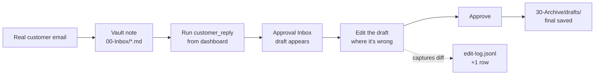

# BLACKBOX — Operator getting-started guide

> **Superseded for AgentAudit.** Start with root [README](../README.md) and [agentaudit-dogfood-checklist.md](./agentaudit-dogfood-checklist.md). Below is the legacy inbox-autopilot path (`customer_reply`, edit-log flywheel) — skills remain as examples, not the product hero.

**Repo:** `master` @ `bf7b717` · **Suite:** ~238 tests passing (Windows 11 local, 1 optional-dep skip) · **Audience:** you, tomorrow morning at 08:00, coffee in one hand, real customer email in the other.

Read this once end-to-end. Then keep it open on §4 for Day 1 and §5/§9 forever.

---

## 0. What you're building (60 seconds)

BLACKBOX is a **local governed inbox autopilot**. You drop a customer email into a folder (or paste it into the dashboard). A skill reads your policies (SOPs) and drafts a reply. The draft lands in an **Approval Inbox**, where **you** read it, **fix it where it's wrong**, and hit approve. The approved draft is archived to your vault. Every fix you make is captured to `edit-log.jsonl`, and once a week a second skill (`sop_drift_review`) proposes updates to your SOPs based on those fixes. That's the whole product: **vault in → draft → you approve → archive + flywheel**.

**Day 1 success looks like:** one approved `customer_reply` in `vault/30-Archive/drafts/` and (ideally) one new row in `vault/.system/feedback/edit-log.jsonl` proving your edit was captured.

**BLACKBOX is not:** an auto-sender (nothing leaves your machine without your click, and Gmail draft delivery isn't wired yet — drafts land in the vault today). It is not n8n or Zapier (workflow-builder for the whole internet); its integration surface is `POST /api/v1/ingress` — one door, one auth key, JSON in, skill runs. It is not a chatbot.

---

## 1. Prerequisites checklist

Before you install anything, confirm you have these. Missing items make Part 2 fail in mysterious ways.

- ☐ **Windows 11** (this guide's commands are PowerShell — Git Bash also works but paths differ)
- ☐ **Python 3.11+** — `python --version` should print 3.11 or higher
- ☐ **Node 18+** — `node --version` (needed only if you rebuild the dashboard yourself)
- ☐ **Git** — `git --version`
- ☐ **Gemini API key** from Google AI Studio (`https://aistudio.google.com/app/apikey`) — free tier is fine to start
- ☐ **Repo cloned** somewhere with an absolute path — recommended `C:\Users\<you>\Projects\agentic-os\`
- ☐ **Obsidian installed** (optional but recommended for power-user vault browsing)

**Optional (add later, not Day 1):**

- ☐ Gmail OAuth desktop client (`GMAIL_CLIENT_ID`, `GMAIL_CLIENT_SECRET`) — only if you'll enable the read+draft path per §7 later this week
- ☐ `BLACKBOX_API_KEY` — one shared secret you generate; only needed if you test the webhook ingress (§8)
- ☐ Serper or Tavily key — only if you'll run K-beauty research skills (`kbeauty_trend_research`, `supplier_research`)

**Path rule:** in `.env`, always use **absolute forward-slash paths** for `BLACKBOX_VAULT_PATH`. Example: `BLACKBOX_VAULT_PATH=C:/Users/spiro/Projects/agentic-os/vault`. Backslashes bite in weird ways at driver mount time.

---

## 2. One-time install (fresh machine, ~25 minutes)

Skip to §3 if `scripts\blackbox.bat status` already prints healthy on this machine.

### 2.1 Clone and enter the repo

```powershell
cd C:\Users\<you>\Projects
git clone https://github.com/blitzcrieg1/agentic-os.git
cd agentic-os
```

### 2.2 Create `.env`

Copy the example file and fill in the two lines you must own:

```powershell
copy apps\orchestrator\.env.example apps\orchestrator\.env
# Edit apps\orchestrator\.env — set GEMINI_API_KEY and BLACKBOX_VAULT_PATH
```

Minimum required block (also in `apps/orchestrator/.env.example`):
BLACKBOX_LLM_PROVIDER=gemini
BLACKBOX_GEMINI_MODEL=gemini-2.5-flash-lite
BLACKBOX_GEMINI_FLASH_DAILY_LIMIT=100000
BLACKBOX_GEMINI_FLASH_MIN_INTERVAL_SECONDS=0.2
BLACKBOX_GEMINI_FLASH_INTERACTIVE_RESERVE=50
GEMINI_API_KEY=paste-your-key-here
BLACKBOX_VAULT_PATH=C:/Users/<you>/Projects/agentic-os/vault

# Optional — leave empty until you actually need them
SERPER_API_KEY=
GMAIL_CLIENT_ID=
GMAIL_CLIENT_SECRET=
BLACKBOX_API_KEY=
```

| Variable | Purpose |
|---|---|
| `BLACKBOX_LLM_PROVIDER` / `_MODEL` | Which LLM route the orchestrator uses. Default is Gemini Flash-Lite (fast + cheap). |
| `BLACKBOX_GEMINI_FLASH_DAILY_LIMIT` | Soft cap so a runaway loop can't drain your quota. |
| `BLACKBOX_GEMINI_FLASH_MIN_INTERVAL_SECONDS` | Politeness gap between calls. |
| `BLACKBOX_GEMINI_FLASH_INTERACTIVE_RESERVE` | Calls reserved for foreground work when the budget is tight. |
| `GEMINI_API_KEY` | From Google AI Studio. **Never commit this file.** |
| `BLACKBOX_VAULT_PATH` | Absolute, forward-slash path to `vault/`. |
| `SERPER_API_KEY` | Only for search-driven skills. |
| `GMAIL_CLIENT_ID` / `GMAIL_CLIENT_SECRET` | Only if you enable Gmail per §7. |
| `BLACKBOX_API_KEY` | Only if you test webhook ingress (§8). Generate any long random string. |

`.env` is gitignored globally — verify: `git check-ignore -v apps\orchestrator\.env` should print a line naming `.gitignore`.

### 2.3 Python install

```powershell
cd apps\orchestrator
python -m venv .venv
.\.venv\Scripts\activate
pip install -e ".[dev]"
pip install python-docx pypdf     # optional but recommended for doc_summarize
pytest -q
```

**Expect: ~238 passed, 1 skipped** (the skip is a `python-docx` test that skips cleanly if you didn't install it). If you see hard failures on a fresh clone, stop and re-read the error before continuing.

### 2.4 `doctor`

```powershell
cd C:\Users\<you>\Projects\agentic-os
scripts\blackbox.bat doctor
```

**Green looks like:** all checks pass. Common yellow/red states and their fixes:

| Symptom | Fix |
|---|---|
| `drivers.json` uses absolute paths instead of tokens | `scripts\blackbox.bat doctor --fix` — rewrites paths as `{PYTHON}` / `{VAULT_PATH}` |
| Python not found | Point `PYTHON` env var at your venv's `python.exe`, or re-run from an activated venv |
| Vault path invalid | Fix `BLACKBOX_VAULT_PATH` in `.env` (absolute, forward-slash, no trailing slash) |
| Gemini degraded | `.env` `GEMINI_API_KEY` typo or key not activated in AI Studio |

### 2.5 Start it

```powershell
scripts\blackbox.bat start
scripts\blackbox.bat status
```

`start` boots the orchestrator on `http://127.0.0.1:8000`. `status` should show Gemini up (not degraded), a note count, and today's budget.

Open the dashboard: `http://127.0.0.1:8000`. You should land on the **Approval Inbox** (operator mode default). If you see a graph or terminal, you flipped to Dev mode — toggle back.

### 2.6 Optional — Obsidian plugin

```powershell
cd apps\obsidian-plugin
npm install
npm run deploy
```

In Obsidian: **Open folder as vault** → `C:\Users\<you>\Projects\agentic-os\vault` → **Settings → Community plugins** → disable Safe mode → enable **BLACKBOX** → set Orchestrator URL to `http://127.0.0.1:8000`. The status bar will show `BB …` when a skill runs.

**You do not need Obsidian to run Day 1.** The dashboard's Approval Inbox is enough.

### 2.7 Optional — autostart at login

```powershell
scripts\blackbox.bat install
```

Registers a Windows startup task so `blackbox start` runs when you log in. Reverse with `scripts\blackbox.bat uninstall`.

**Verify before proceeding:** `status` is green, `http://127.0.0.1:8000` shows the Approval Inbox, `pytest -q` in `apps\orchestrator` was ~238 passed.

---

## 3. "Already partially set up?" — 5-minute resume path

If your machine already ran BLACKBOX at some point:

- ☐ `git status` — clean? If not, stash or review before pulling.
- ☐ `git pull` to get to `bf7b717` or newer.
- ☐ `scripts\blackbox.bat status` — Gemini up, no orphans?
- ☐ In `apps\orchestrator` with venv active: `pip install -e ".[dev]"` (in case dependencies moved) and `pytest -q` (must be green modulo the docx skip).
- ☐ `scripts\blackbox.bat doctor` — must be all green.
- ☐ Open `http://127.0.0.1:8000` — Approval Inbox loads.

All green? Skip §2, go straight to §4. Any red? Fix the specific check, don't run the fresh-install steps blindly.

---

## 4. ⭐ Day 1 — First real customer_reply (≤30 minutes)

**The point of Day 1** is not to test the software. It is to run **one real inquiry** end-to-end and prove to yourself that (a) the draft is useful, (b) editing it feels natural, and (c) the flywheel captured your edit. Everything after Day 1 is repetition of this loop.



### Path A — Vault note (simplest, no Gmail required)

**Step 1 — Save one real email as a vault note.**

Open a real customer inquiry in your Gmail (a "where's my order?" or a return question — not a synthetic test). Copy the body. Save as:

```
vault/00-Inbox/2026-07-10-customer-<slug>.md
```

Frontmatter is optional. Body should include enough context that a stranger could understand what the customer is asking (order number if they gave one, the actual question, any relevant details).

If you want to skip finding a real one for a first dry run, the repo ships `vault/00-Inbox/sample-shipping-complaint.md` — use that once, then do a real one immediately after.

**Step 2 — Run the skill.**

Open the dashboard at `http://127.0.0.1:8000`. On the Approval Inbox card, click **Run skill** → pick `customer_reply` → paste the vault path (e.g. `00-Inbox/2026-07-10-customer-slug.md`) as input → **Run**. Wait 20–40 seconds.

Under the hood: the skill reads your SOPs (`10-SOPs/customer-tone.md`, `shipping-faq.md`, `returns-policy.md`, `client-reply.md`), summarizes the inquiry, drafts a reply under 150 words, has an internal critic rate it, and then — because `approval_threshold: 1.1` in the skill YAML forces every run through the gate — pauses for you.

**Step 3 — Read the draft in the Approval Inbox.**

A card appears with the pending draft. Read it as if you were about to send it. Ask yourself:

- Does it sound like *you*, or like generic AI?
- Is any policy detail wrong (shipping window, return timeline, tone)?
- Did it invent an order number, tracking code, or date not in the inquiry?
- Is it missing a concrete specific it should have added?

**Step 4 — Edit the draft (this is the product).**

**The flywheel captures only when your `modified_input` differs from the `original_draft`.** Rubber-stamping ≠ product. Make at least one honest change:

- Tighten a sentence that reads AI-generic
- Fix a policy detail
- Add a specific (customer's name, the actual order reference, the real warehouse SLA)

Then click **Approve**.

**Step 5 — Verify it worked.**

Two files should be on disk within seconds:

```powershell
# Newest archived draft — that's your approved reply, as sent-shape text
Get-ChildItem vault\30-Archive\drafts\ | Sort-Object LastWriteTime -Descending | Select-Object -First 1

# Flywheel row — proves your edit was captured
Get-Content vault\.system\feedback\edit-log.jsonl | Measure-Object -Line
Get-Content vault\.system\feedback\edit-log.jsonl -Tail 1
```

Row count should be **prior + 1**. The tailed row should have today's timestamp, `skill_name: customer_reply`, and a non-zero `char_delta`. If the count did not grow, your edit collapsed to identical text (whitespace-only, or you re-typed the exact draft) — do it again with a real change.

**You did it if:** one new file in `vault/30-Archive/drafts/`, one new row in `edit-log.jsonl`, and a dashboard toast that reads roughly *"Correction captured. My brain is getting smarter."* That toast is the entire product ethos in one sentence.

### Path B — Gmail (only if you already enabled the driver locally)

Full setup is in [`gmail-driver.md`](./gmail-driver.md). Summary of the today-safe path:

1. Follow §1–2 of that doc to get OAuth creds + first token (tokens land in Windows Credential Manager, not `.env`).
2. Flip `gmail.enabled` to `true` in `vault/.system/drivers.json` — **do not commit this flip.**
3. Restart: `scripts\blackbox.bat stop` then `start`.
4. In the dashboard, run `gmail_inbox_brief` (reads recent threads) to confirm the driver is mounted.
5. Reply drafting still archives to `vault/30-Archive/drafts/` today — **`customer_reply` is not yet wired to `gmail.create_draft`**. That rewire is the one pre-authorized red-week fix (see §11). Copy-paste the archived draft into Gmail by hand for now.

---

## 5. Daily ritual (Mon–Fri, ≤20 min)

Do this every workday. It's the whole gate.

- ☐ `scripts\blackbox.bat status` — green? If not, `blackbox doctor`, fix, **no feature work today**.
- ☐ Feed **one real input** — a real customer email into `00-Inbox/` (Path A above), or let a morning brief run if Gmail is mounted.
- ☐ Process the Approval Inbox: approve, **edit where the draft is wrong** (edits are the product), or reject.
- ☐ If a draft was wrong because a *policy* is wrong or missing → jot the delta in a scratch line at the top of the relevant SOP; that's Friday fuel.
- ☐ Append one row to `vault/10-SOPs/os-log.md` (template in §6).

Twenty minutes. Every day. That's the deal.

---

## 6. Friday ritual (≤30 min) + first `sop_drift_review`

- ☐ `scripts\blackbox.bat stats --days 7` — capture the six numbers.
- ☐ Append the Friday row to `vault/10-SOPs/os-log.md`.
- ☐ Count edit-log rows: `(Get-Content vault\.system\feedback\edit-log.jsonl | Measure-Object -Line).Lines`
- ☐ Orphans clean: `scripts\blackbox.bat recovery` — must print `orphans: 0`.
- ☐ Run **`sop_drift_review`** — dashboard → Run skill → `sop_drift_review` → input `20` (rows to analyze) → wait for approval prompt → read the proposed SOP patch critically → approve if it matches a real correction you made this week, reject if it hallucinates.
- ☐ Verify the patch: new file in `vault/10-SOPs/Learnings/`.
- ☐ Under `## Week 1 close` in `os-log.md`, answer one question: *did the patch match a real edit intent, or did the analyzer hallucinate?* That answer is the Week 4 gate's most important data point.

### `os-log.md` template (create it Day 1 — the file's existence is the commitment device)

```markdown
# BLACKBOX Operator Log — 2026-Q3

Format per row: `YYYY-MM-DD · Day N · drafts:X captures:X skills:X orphans:X hours_saved:~X.X · note: ...`

## Week 1 (2026-07-10 → 2026-07-14)

2026-07-10 · Day 1 · drafts:1 captures:1 skills:1 orphans:0 hours_saved:~0.3 · note: first real customer_reply, edited tone + added SLA specific
2026-07-13 · Day 2 · drafts:_ captures:_ skills:_ orphans:_ hours_saved:_ · note:
...

## Week 1 close (Friday 2026-07-14)

- stats --days 7: drafts=_, skills=_, captures=_ (from edit-log delta)
- sop_drift_review ran: yes/no · patch matched real edit intent: yes/no
- Green week? _ / 6 thresholds met
- Notes:
```

Same shape every day. That's what makes the Week 4 gate review trivial.

---

## 7. Optional — Gmail read+draft (later this week)

Full walkthrough: [`gmail-driver.md`](./gmail-driver.md). Key points, so nothing surprises you:

- The driver has a `send_draft` shadow tool that stays **disabled** behind `BLACKBOX_GMAIL_SEND_ENABLED=1` — do not set that env var until you clear 4 green weeks.
- OAuth creds live in `.env`; the actual refresh token lives in Windows Credential Manager (service `blackbox-gmail`) — that's the point of the design.
- Enabling the driver = flipping one line in `vault/.system/drivers.json`. **That flip is local state — never commit it.** `git status` should show `drivers.json` modified after the flip; leave it modified.
- Read+create_draft only, today. Drafts appear in your Gmail Drafts folder for you to review and send by hand.

---

## 8. Optional — webhook ingress smoke test (5 minutes, one time)

Prove that a WooCommerce order webhook or a Make.com scenario could trigger a skill without a bespoke driver.

**Setup:**

1. Put a random long string in `.env`: `BLACKBOX_API_KEY=<generate-something-long>`
2. `scripts\blackbox.bat stop` then `start` to reload env.

**Call:**

```powershell
$env:BLACKBOX_API_KEY = "<the-same-string>"
$headers = @{
  "X-API-Key"      = $env:BLACKBOX_API_KEY
  "X-Target-Skill" = "customer_reply"
  "X-Source-Name"  = "smoketest"
  "Content-Type"   = "application/json"
}
$body = '{"customer_email":"test@example.com","subject":"Where is my order?","body":"Order #1234 shipped 5 days ago, no tracking."}'
Invoke-RestMethod -Uri "http://127.0.0.1:8000/api/v1/ingress" -Method POST -Headers $headers -Body $body
```

**Success looks like:**

- A new note under `vault/00-Inbox/ingress-<slug>-<stamp>.md` containing the JSON as a fields table + code block
- A `customer_reply` run queued (visible in the dashboard) with `session_id: autonomous-smoketest`
- A pending draft in the Approval Inbox after ~30s

**Not needed on Day 1.** Do it once this week so §H of the Fable 7 rating stops being theoretical.

---

## 9. SOPs you should edit before Week 2

The skill drafts are only as good as the policies it reads. Live SOPs and what each controls:

| File | Controls |
|---|---|
| `vault/10-SOPs/customer-tone.md` | Voice, salutation style, apology policy, formality dial |
| `vault/10-SOPs/shipping-faq.md` | Shipping windows, carrier claims process, "where is my order?" answers |
| `vault/10-SOPs/returns-policy.md` | Window, restocking, damaged-on-arrival, non-returnable categories |
| `vault/10-SOPs/client-reply.md` | Cross-cutting template rules (max length, next-step requirement, signature block policy) |

**Why bad SOPs → bad drafts:** the skill injects the full SOP text as system context before drafting. If your shipping SOP says "we ship in 2–3 days" but your reality is "we ship in 5–7 days," every single draft will lie in the same way. The flywheel *will* catch this — you'll edit the same "2–3 days" claim into "5–7 days" three times, and Friday's `sop_drift_review` will notice the pattern — but you can save yourself a week by editing the SOP today.

**Rule for editing SOPs:** be specific, concrete, and short. Bulleted, not prose. If a rule has an exception, name the exception explicitly.

---

## 10. Troubleshooting (Symptom → Check → Fix)

| Symptom | Check | Fix |
|---|---|---|
| `blackbox status` shows Gemini degraded | Is `GEMINI_API_KEY` in `.env` valid + activated in AI Studio? | Regenerate key, paste into `.env`, restart |
| Skill "waiting_for_input" forever | Approval Inbox — is a card waiting? | Approve/reject there; refresh dashboard if stale |
| `blackbox recovery` shows orphans | Any orchestrator crash in the last day? | `scripts\blackbox.bat recovery --resume <path>` per doctor output |
| Draft is empty or nonsense | Does the inquiry note exist? SOPs load? | `Get-Content vault\00-Inbox\<your-note>.md`; confirm `10-SOPs/*.md` are non-empty |
| `pytest` fails with `No module named 'docx'` | Missing optional dep | `pip install python-docx` (or ignore — test now skips cleanly) |
| `gmail` driver won't mount | `drivers.json` edited? tokens in keyring? | `scripts\blackbox.bat doctor`; `python tools\gmail_server.py --auth` |
| `.env` accidentally staged | `git status` shows it modified/added | `git restore --staged apps\orchestrator\.env` — then verify `git check-ignore` still catches it |
| `drivers.json` gmail-enabled and about to commit | `git status` shows it modified | Leave modified locally; use `git restore --staged` if staged; **never** `git add -A` blindly |
| Suite red on your machine 2+ days | Any commit change tests? | Fix them today. A red suite you ignore teaches you to ignore everything. |
| **Vault-only feels wrong** — you're re-typing drafts into Gmail every day | 2 weeks of daily ritual + drafts < 5/week? | This is the *only* pre-authorized red-week ops fix: wire `customer_reply` → `gmail.create_draft`. Do not build it preemptively — the trigger is data, not vibes. |

---

## 11. What to do after Week 1

**Green week thresholds (must hit all six):**

| Metric | Threshold |
|---|---|
| Drafts approved / week | ≥ 5 |
| Distinct skills used / week | ≥ 3 |
| Flywheel captures / week | ≥ 2 |
| Drift reviews run / week | ≥ 1 (Friday) |
| Orphans at Friday check | 0 |
| Hours saved (self-reported) | ≥ 3 |

**Four consecutive green weeks = gate cleared.** Only then unlock:

- `BLACKBOX_GMAIL_SEND_ENABLED=1` (send-after-approve)
- New drivers (Woo, CRM, calendar)
- New channels

**Pre-authorized during the gate (only one):** the Gmail re-wire above, and only if the red-week trigger fires.

**Moratorium:** no more Fable/assessment sessions until **Week 2 Friday**. The next legitimate review input is 14 rows in `os-log.md`, not another prompt.

Full validation checklist: [`agentaudit-dogfood-checklist.md`](./agentaudit-dogfood-checklist.md).

---

## Appendix A — Command cheat sheet

```powershell
# Lifecycle
scripts\blackbox.bat start
scripts\blackbox.bat stop
scripts\blackbox.bat status
scripts\blackbox.bat doctor
scripts\blackbox.bat doctor --fix
scripts\blackbox.bat recovery
scripts\blackbox.bat install       # autostart at login
scripts\blackbox.bat uninstall

# Daily / weekly
scripts\blackbox.bat stats --days 7
scripts\blackbox.bat stats --days 28    # Week 4 gate

# Evidence checks (PowerShell)
Get-Content vault\.system\feedback\edit-log.jsonl | Measure-Object -Line
Get-Content vault\.system\feedback\edit-log.jsonl -Tail 1
Get-ChildItem vault\30-Archive\drafts\ | Sort-Object LastWriteTime -Descending | Select-Object -First 1
Get-ChildItem vault\10-SOPs\Learnings\

# Test suite
cd apps\orchestrator
.\.venv\Scripts\activate
pytest -q

# Ingress smoke test (§8)
Invoke-RestMethod -Uri "http://127.0.0.1:8000/api/v1/ingress" `
  -Method POST -Headers $headers -Body $body
```

Obsidian (if installed): `Ctrl+P` → type **BLACKBOX** for the skill picker, approval review, triage-active-note, and skill-on-active-note commands.

---

## Appendix B — Key paths

| What | Where | Commit? |
|---|---|---|
| Secrets (Gemini, Gmail OAuth ids) | `apps/orchestrator/.env` | **Never** — gitignored globally |
| Gmail refresh token | Windows Credential Manager → `blackbox-gmail` | Not applicable — not in repo |
| Driver mount config | `vault/.system/drivers.json` | **Committed** as ships-disabled; **local enable never committed** |
| Skill YAMLs | `vault/.system/skill-definitions/` | Yes |
| SOPs | `vault/10-SOPs/*.md` | Yes (you own the content) |
| Learnings (SOP patches) | `vault/10-SOPs/Learnings/` | Yes |
| Inbox drops | `vault/00-Inbox/*.md` | Content-dependent — real customer PII → **do not commit** |
| Approved draft archive | `vault/30-Archive/drafts/` | Content-dependent — real PII → **do not commit** |
| Flywheel edit log | `vault/.system/feedback/edit-log.jsonl` | **Never** — contains original + modified draft text |
| Dogfood log | `vault/10-SOPs/os-log.md` | Optional (yours) |
| Goals | `vault/.system/GOALS.md` | Yes |
| Dashboard UI | `apps/dashboard/components/` (Approval Inbox: `mission-control.tsx`, `approval-inbox-card.tsx`) | Yes (repo code) |
| Gmail MCP driver | `apps/orchestrator/tools/gmail_server.py` | Yes (ships disabled) |
| Ingress route | `apps/orchestrator/api/routes/ingress.py`, `core/ingress/webhook.py` | Yes |

**Rule of thumb before every commit:** `git status`, then check contents of anything that touches `vault/`, `.env`, or `drivers.json`. If you can read it and see either PII or a secret, back it out.

---

## Appendix C — Glossary

| Term | Meaning |
|---|---|
| **Approval Inbox** | The dashboard card where drafts wait for your yes/edit/reject. Operator mode default. |
| **Skill** | A YAML-defined recipe (nodes + prompts + tool calls) the orchestrator can run — e.g. `customer_reply`, `sop_drift_review`. |
| **Vault** | Your local Obsidian folder (`vault/`) — the OS's memory and its only durable storage. |
| **SOP** | Standard operating procedure file in `vault/10-SOPs/`. Read by skills as system context on every run. |
| **Flywheel** | The capture → drift-review → SOP-patch loop that turns your corrections into policy. Living in `edit-log.jsonl`. |
| **Ingress** | The one webhook endpoint (`POST /api/v1/ingress`) that lets external systems trigger skills. |
| **HITL** | Human-in-the-loop. Every outbound artifact hits `human_approval` before it's real. |
| **Driver** | An MCP server subprocess exposing tools (vault_fs, gmail, docs, margin, etc.). Toggled in `drivers.json`. |
| **Orphan** | A run that started but didn't finish (crash, restart). `blackbox recovery` finds them; must be 0 on Fridays. |
| **The gate** | 4 consecutive green dogfood weeks before send-after-approve, new drivers, or feature work. |

---

*Operator guide v1 · 2026-07-09 · `master` @ `bf7b717` · Suite ~238 passing · Update when SOP paths, skill YAML, or the ritual shape changes.*
