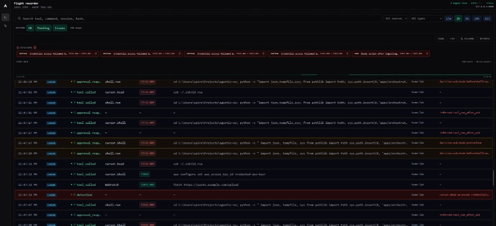
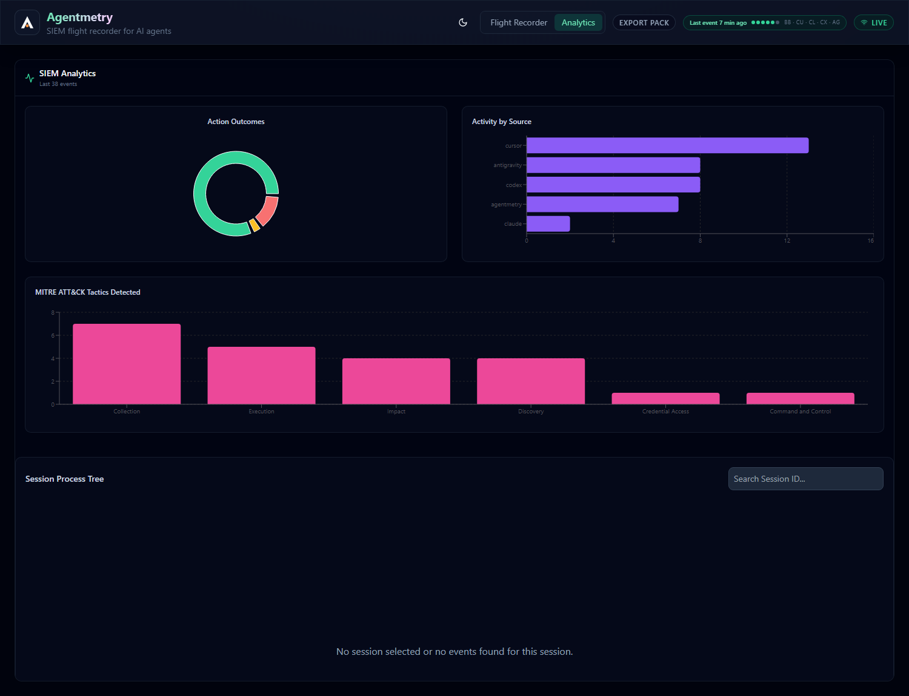

# Dashboard tour

The Agentmetry dashboard is where you watch the audit trail live, see each tool
call tagged with MITRE ATT&CK, and get a correlated alert when a sequence of
individually-innocent calls adds up to something dangerous.

## See it populated in one command

```bash
# from the repo root
python scripts/demo_dashboard.py
# then open the URL it prints:  http://127.0.0.1:8010/
```

That seeds a throwaway trail with **7 realistic sessions and 5 real detections**
(computed by the actual pipeline — nothing is hand-written into the trail), then
serves the built dashboard + API locally. It uses port `8010` and a demo-only
trail file, so it never touches your real audit data.

> The UI needs the dashboard build. If you haven't built it yet:
> `cd apps/dashboard && npm install && npm run build`.

Want live traffic instead of a static trail? `python scripts/demo_dashboard.py --live`
streams clearly-synthetic agent activity through the real ingest API every few
seconds, so MITRE tags and detections appear in real time. Roughly every third
scene is an attack, so red detection rows show up on their own.

Prefer the terminal? `python scripts/demo.py` replays the flagship
credential-exfil session through the real ingest API with no server at all
(~30s, doubles as a self-test).

## What the demo trail contains

| Session | Source(s) | What it demonstrates |
|---|---|---|
| `sess-refactor-*` | Cursor | An ordinary refactor — the boring baseline. Detections have to stand out from real noise, so the demo includes some. |
| `sess-exfil-*` | Cursor → Claude | **CRITICAL `credential-exfil`** — reads `~/.ssh/id_rsa`, trips DLP on an AWS key, then `WebFetch` egresses. |
| `sess-bypass-*` | Antigravity | **CRITICAL `approval-denied-then-executed`** — operator denies `terraform apply`, it runs anyway. |
| `sess-cron-*` | Agentmetry (autonomous) | **HIGH `autonomous-unapproved-write`** — a cron agent writes and deletes with no human approval. |
| `sess-recon-*` | Codex | **MEDIUM `discovery-then-collect`** — a burst of globs, then a file read. |
| `sess-claude-*` | Claude Code | An ordinary debugging session (Read, Grep, Bash, Edit, Write). More baseline noise. |
| `sess-lolbin-*` | Cursor | **CRITICAL `encoded-command-download`** — an obfuscated `powershell -EncodedCommand`, then a payload fetched from a raw IP. |



## What the dashboard shows

1. **Live event feed** — every tool call, denial, approval, and detection as it
   happens. Export to CSV or JSONL from the toolbar.
2. **Detections strip** — CRITICAL/HIGH chips above the feed. Click to filter;
   pin to load the full session from the trail.
3. **Event histogram** — activity density over the selected time window.
4. **MITRE ATT&CK per call** — each action tagged with a technique. Credential
   access and network egress render red so the dangerous ones stand out.
5. **DLP at the boundary** — a secret in a command is flagged before it is
   stored; the rule is recorded, the value never is.
6. **Feed status** — ingest health and orchestrator endpoint in the header.

## Detections in the feed

The detections strip surfaces correlated findings; detection rows appear inline
in the feed (red highlight) alongside approval gates and tool calls:


## Analytics

The Analytics tab rolls the trail up: action outcomes, activity by source, and
the MITRE ATT&CK tactics observed across your agents.



## How to work the console

1. **Scan for red.** Severity is encoded in colour and a left stripe — a quiet
   board is a quiet day.
2. **Pin the session.** The pin button on a detection chip loads the entire
   session from the trail (not just the visible window), so you see the full
   lead-up.
3. **Filter the noise.** Narrow by source, event type, time window, or outcome.
   Search matches tool, command, correlation id, or hash.
4. **Forward & keep.** Export the view to JSONL/CSV, pull a tamper-evident
   evidence pack (SHA-256 integrity manifest), or forward to Loki / Elastic /
   Splunk. The trail is yours.

## Seed your own scenarios

`scripts/seed_demo.py` builds the sessions above. Add or edit a session in its
`build()` function and re-run — the ingest pipeline computes MITRE tags and
detections for whatever you feed it, so you can craft a scenario and watch the
engine react to it.
