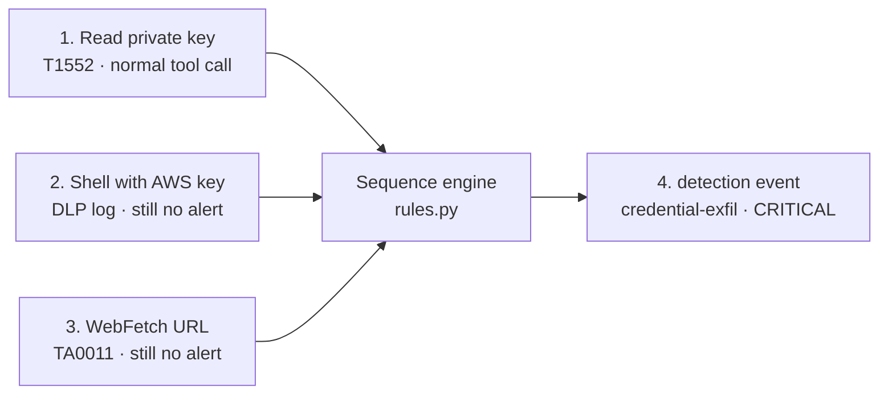
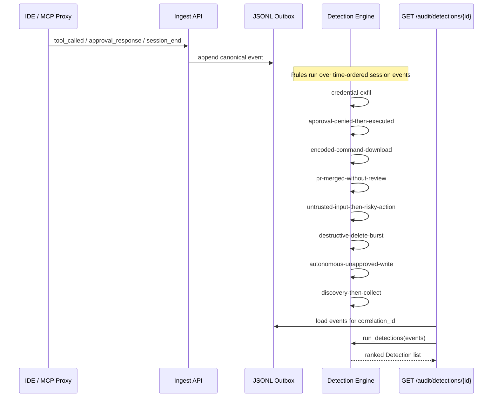

# Detection rules: how sequences are matched, and every rule that ships

The [README](../README.md#behavioral-detection-engine) covers what the detection
engine is for. This is the detail: how ordered matching works, the full rule
table, and the published research the rules were built against.

## A note on publishing rules

Everything below is public, which is deliberate. Sigma, Elastic and Splunk ESCU
all publish their detection content, and for a tool whose credibility rests on
being inspectable, hiding the rules would cost more than it protects. You cannot
verify a detection claim you are not allowed to read.

One consequence is worth being deliberate about. Publishing the **default
thresholds** means someone who has read this page knows where the line is and
can sit just under it. That is why thresholds live in
[`agentmetry/policies/detection/manifest.yaml`](../apps/orchestrator/agentmetry/policies/detection/manifest.yaml) rather
than in code: a real deployment should tune them to its own traffic rather than
run the shipped defaults. Do that during the first two weeks, against your own
noise.

---

## How sequence rules work

No single event in the demo session looks like an incident. The engine waits for an ordered pattern inside one `correlation_id` (one agent session), then emits one detection event:



Each rule in the table below is the same idea: **ordered steps within a session**, not a threshold on one row. `credential-exfil` requires credential access (T1552) *then* network egress (TA0011) in that order. Reversed order does not fire.



| Rule ID | Severity | Pattern |
| ------- | -------- | ------- |
| `credential-exfil` | critical | Credential access (T1552) → network egress (TA0011) |
| `credential-read-then-cloud-api` | critical | Credential access (T1552) → kubectl / aws / gcloud / az / HF CLI |
| `dotfile-read-then-git-push` | critical | Credential access (T1552) → `git push` or `gh repo create` |
| `remote-staging-then-execute` | critical | Fetch from public staging host (gist, HF raw, GitHub raw) → execute in a later step |
| `subagent-swarm-burst` | high | ≥5 subagent starts in one session (Kimi AgentSwarm, Qwen Agent Teams) |
| `approval-denied-then-executed` | critical | Human denied a gated tool → same tool executed successfully later |
| `encoded-command-download` | critical | Remote code fetched and executed: a raw-IP download, or a fetch piped into an interpreter (`curl … \| bash`). T1105, plus T1027 when base64-encoded |
| `pr-merged-without-review` | critical | A pull request merged with no preceding read of its diff (T1195.002) |
| `untrusted-input-then-risky-action` | high | Session ingested externally-authored content (a GitHub issue, a fetched page) → then performed a risky action |
| `destructive-delete-burst` | high | 5+ deletions in one session, by technique or command (`rm -rf`) |
| `discovery-then-collect` | medium | Filesystem recon burst (TA0007) → data collection |
| `session-tool-burst` | high | Unusually dense tool activity in one session, measured over a time window rather than a session total |
| `off-hours-activity` | medium | Unscheduled autonomous impact action outside business hours. **Opt-in** (`AGENTMETRY_DETECT_OFF_HOURS=1`) with an operator-set window; scheduled jobs excluded |

Host-scoped rules run across sessions on one machine rather than within one:

| Rule ID | Severity | Pattern |
| ------- | -------- | ------- |
| `host-subagent-swarm-burst` | high | Subagent spawns across several sessions on one host inside a window |

Query detections for a session:

```http
GET /api/v1/audit/detections/{correlation_id}
X-API-Key: <optional>
```

---

## Agent Data Injection

[*Agent Data Injection Attacks are Realistic Threats to AI Agents*](https://arxiv.org/abs/2607.05120)
(Choi et al., July 2026) demonstrates remote code execution and supply-chain
compromise against **Claude Code, Codex, Gemini CLI and Antigravity**. ADI hides
malicious data inside content an agent already trusts, such as a GitHub issue
comment carrying forged author metadata, so the agent runs an attacker's command
believing it came from a maintainer.

The paper tested model hardening, input guardrails, alignment output guardrails,
plan-then-execute, sandboxing and dual-LLM. All of them fail on ADI, for a
reason worth quoting:

> ADI "corrupts only the data the agent acts on, leaving the agent's task
> aligned with the user prompt."

Nothing about the request looks wrong. The agent is doing what you asked. When
the prompt looks clean and the guardrails pass, the agent's **behaviour** is the
only evidence left, which is the layer Agentmetry works at. Both published
chains are sequences of tool calls, and both are detected:

| Paper | Chain | Fires |
|-------|-------|-------|
| §4.2 RCE via origin injection | `gh issue view` → attacker's command | `encoded-command-download` + `untrusted-input-then-risky-action` |
| §4.3 Supply chain via tool-response injection | `gh pr view` → merge, diff never read | `pr-merged-without-review` |

**To be clear about the boundary: Agentmetry does not prevent ADI, and nothing
here should be read as claiming otherwise.** Prevention requires isolating
trusted from untrusted data inside the agent, which is the paper's own
conclusion and is not something a recorder can do. We detect the consequence.

## Experimental: not in the published set

`autonomous-unapproved-write` keys on `initiator.actor_type == "autonomous"`.
The bus and SDK paths produce that value (cron, vault_watch, ingress,
recovery), so the rule is correct and still registered. No IDE capture surface
produces it: across roughly 32,000 events of real traffic from five agent
surfaces the actor is `human`, `agent` or `system` and never once `autonomous`.
Ingest deliberately cannot let a client claim it either, because that would let
anyone fake this detection.

So it is not counted in the rule total, not exported to Sigma, and not part of
any published claim, until a capture surface produces the signal it reads. It
stays registered so a session that really is autonomous is still caught.
