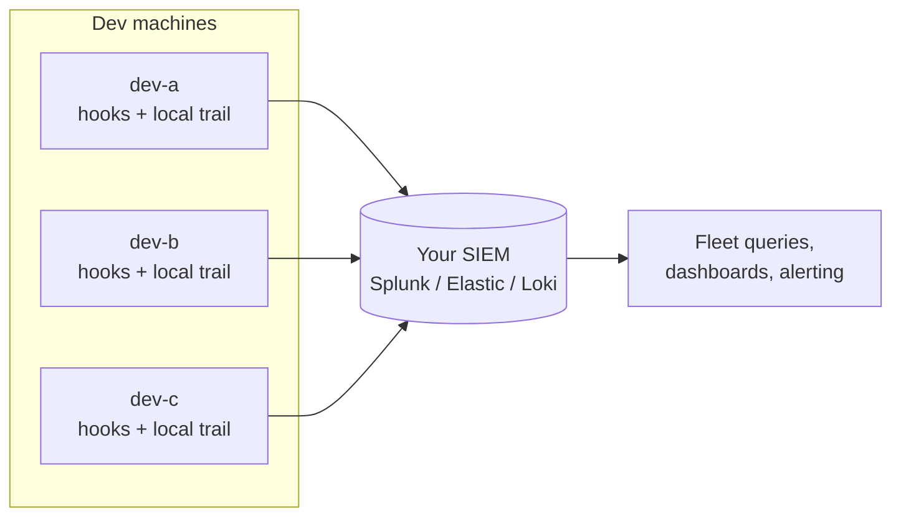

# Running Agentmetry across a team, using the SIEM you already have

Agentmetry installs on one machine and keeps its evidence on that machine. That
is deliberate: the trail belongs to the person whose agent produced it, and
there is no vendor cloud in the path.

It is also the first objection a security engineer raises, and fairly. You do
not want fifteen dashboards. You want one place to answer "did any agent on this
team read a credential and then egress this week?"

You already own that place. This document shows how to get there with the
forwarders that ship today, and is honest about the three things it does not
give you.

## The shape

Every developer machine records locally and forwards a copy. Nothing centralizes
except the events themselves.



Each host keeps working when the SIEM is down. Forwarding is best effort by
design; the local trail is the source of truth and the hook spools events while
the orchestrator is unreachable. A SIEM outage costs you central visibility for
its duration, not evidence.

## What makes fleet queries work

Three fields do the heavy lifting. They are on every canonical event.

| Field | Why it matters at fleet scale |
| ----- | ----------------------------- |
| `fleet_id` | Which org or deployment. Set `AGENTMETRY_FLEET_ID` at install time so multi-team SIEM queries can scope to one customer or business unit. |
| `host_id` | Which machine. Defaults to the OS hostname; set it to something your asset inventory recognizes. |
| `actor.id` / `initiator.id` | Which human the session belongs to. Defaults to `AGENTMETRY_OPERATOR_ID`. |
| `correlation_id` | One agent session. This is the join key for everything, and it is why sequence questions are answerable at all. |

Set the operator id per machine at install time, or the whole fleet arrives as
one anonymous blob:

```bash
# apps/orchestrator/.env on each machine
AGENTMETRY_FLEET_ID=consulting-pilot
AGENTMETRY_OPERATOR_ID=alex.chen
AGENTMETRY_AUDIT_SINK=file,splunk
AGENTMETRY_SPLUNK_HEC_URL=https://splunk.internal:8088/services/collector
AGENTMETRY_SPLUNK_HEC_TOKEN=...
```

Per-backend setup lives in
[splunk-hec.md](splunk-hec.md), [elastic-ecs.md](elastic-ecs.md) and
[loki-homelab.md](loki-homelab.md). The Sigma pack in
[sigma/](sigma/) gives you the detection content.

## The four questions worth alerting on

These are the queries to build first. Splunk syntax; the Elastic and Loki
equivalents are in the per-backend docs.

**1. Any critical detection, anywhere in the fleet.**

```
index=agentmetry action.type=detection action.outcome=critical
| stats count by host_id, detection.rule_id, correlation_id
```

**2. A finding somebody closed as accepted risk.** This is the one a security
engineer should read every week. It is a decision to keep operating with a known
exposure, and it should never be silent.

```
index=agentmetry action.type=detection_disposition action.outcome=risk_accepted
| table _time, fleet_id, host_id, disposition.rule_id, disposition.decided_by, disposition.note
```

**3. Detections nobody answered.** Join detections against dispositions and look
for the gap. An untriaged detection evidences that the system noticed, not that
anyone acted, so this count is the real health metric for the deployment.

```
index=agentmetry action.type=detection
| eval key=correlation_id."::".'detection.rule_id'
| search NOT [ search index=agentmetry action.type=detection_disposition
               | eval key=correlation_id."::".'disposition.rule_id' | fields key ]
| stats count by host_id, detection.rule_id
```

**4. A host that stopped reporting.** Silence is the failure mode that looks
like success. Alert on it.

```
index=agentmetry | stats latest(_time) as last by host_id
| where last < relative_time(now(), "-24h")
```

## Rolling it out

1. **Pick one machine and run it for two weeks** before touching anyone else's.
   You will tune thresholds in `agentmetry/policies/detection/manifest.yaml`, and you would
   rather do that against your own noise than the team's.
2. **Set `AGENTMETRY_FLEET_ID`, `AGENTMETRY_OPERATOR_ID`, and a recognizable `host_id` per machine.** Everything
   downstream depends on these being meaningful.
3. **Start in `log` mode.** DLP and tool policy default to recording matches
   without blocking. Move to `block` only for rules you have watched fire
   cleanly for a while. A security tool that breaks a developer's workflow in
   week one gets uninstalled in week two.
4. **Distribute policy manifests the way you distribute other config.** They are
   plain YAML in git. Agentmetry hashes the manifest into every evidence pack,
   so you can prove which version was in force during a period.
5. **Put the untriaged-detection query on a dashboard someone owns.** Detection
   without response is the failure this whole design is trying to make visible.

## What this does not give you

Three limits, stated plainly, because finding them yourself in month two is
worse than reading them now.

**No central enforcement.** Policy is per machine. If a developer edits their
local manifest or sets `AGENTMETRY_TOOL_POLICY_MODE=log`, nothing stops them and
no central console shows it. You can detect drift by hashing the manifest at
each host and comparing, but Agentmetry does not push policy and does not
prevent local changes. Central policy distribution is an enterprise lane item,
not a beta capability. See
[enterprise-lane.md](../compliance/enterprise-lane.md).

**No central triage.** Dispositions are recorded per host and forwarded as
events, so your SIEM sees every decision. It cannot write one back. Two analysts
working the same finding on different machines will not see each other's notes.
The events are the shared record; the workflow is not shared.

**No coverage of what Agentmetry does not orchestrate.** This is the important
one. Agentmetry records the agents you wire into it: hooked IDEs and the MCP
stdio proxy. It does not see browser ChatGPT, an IDE with hooks disabled, an
agent running in a container you did not instrument, or an unmanaged Copilot. It
is not a CASB and does not claim to be. **Absence of an event is not evidence
that nothing happened.** Any fleet rollout should pair this with whatever
network or endpoint controls you already use for unmanaged tool usage.

## Sizing

Measured from a real dogfood trail (6,446 events over six active days, one
developer running Claude Code and Cursor), so you can plan storage rather than
discover it.

| Measure | Observed |
| ------- | -------- |
| Events per active developer per day | 199 low, 1,119 median, 2,542 heavy |
| Canonical event on the wire | 1.1 KB median, 2.2 KB at p90 |
| Per developer per month | roughly 60 MB forwarded at the median day |

Two caveats on those numbers. The tail is long: the largest single event in that
sample was 44 KB, because a tool response was captured verbatim. And the sample
is one person, so treat the median as a starting point for capacity planning,
not a contract. Measure your own after the two-week pilot below.

Detections and dispositions are a rounding error on top; there are orders of
magnitude fewer of them than tool calls. Commands are hashed by default, so
event size does not grow with the length of what the agent ran.

## Related

- [Enterprise lane](../compliance/enterprise-lane.md), for what a paid
  deployment would add and what will not be built
- [ISO 42001 mapping](../compliance/iso-42001-mapping.md), for the governance
  review workflow
- [Event schema](../agentmetry-event-schema.md), for every field you can query
